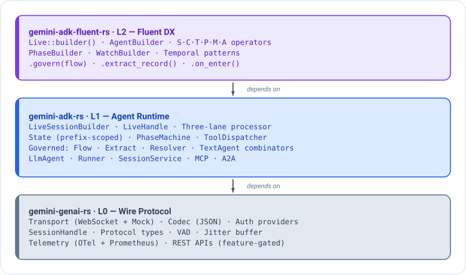
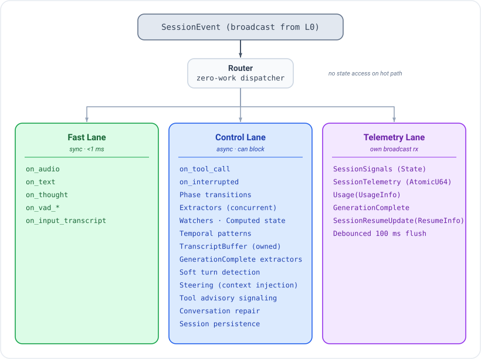

# gemini-rs

## Architecture

Three-crate layered stack for the Gemini Multimodal Live API:

<p align="center"></p>

Plus `crates/gemini-memory-rs` (contextual memory engine for Live sessions — OKF Markdown memory, local BM25 retrieval, session ingestion and reconciliation), `apps/gemini-adk-web-rs` (Axum Web UI), `apps/gemini-adk-api-rs` (REST API server), `examples/agents`, `examples/voice-chat`, `examples/tool-calling`, `examples/transcription`, `examples/text-chat`, and `tools/gemini-adk-transpiler-rs`.

## Import Guidance

Always import from the highest-level crate you need:

```rust
// Kernel DX — the ~40 types a typical application touches (recommended start)
use gemini_adk_fluent_rs::prelude::*;

// Contextual memory for Live sessions (optional, independent of the L0/L1/L2 stack)
use gemini_memory_rs::prelude::*;

// Runtime only (building custom processors)
use gemini_adk_rs::*;

// Wire protocol only (raw WebSocket access)
use gemini_genai_rs::prelude::*;
```

### Prelude kernel + submodule homes (gap #9 carve)

The L2 `prelude` is a **kernel**, not an everything-glob: builders, the
`S·C·T·P·M·A·E·G` algebra, operators/patterns, `Live`, `State`/`StateKey`,
core errors, core flow (`Flow`/`Guard`/`FlowMonitor`/`FlowMode`/`Verdict`/
`ToolPolicy`), core tools (`SimpleTool`/`TypedTool`/`ToolFunction`/
`ToolDispatcher`/`#[tool]`/`Extract`/`Frame`), `BaseLlm`/`GeminiLlm`/`GeminiLlmParams`, callback
contexts, the common Live session types, the text-agent combinators, build-time
validation (`check_contracts`/`ContractViolation`/`diagnose`), and the L0 wire
prelude. Everything else lives in a focused submodule — import what you need:

```rust
use gemini_adk_fluent_rs::live::*;          // full Live control plane (persistence, repair,
                                            // steering, transcripts, contracts, soft-turn, …)
use gemini_adk_fluent_rs::text::*;          // text-agent runtime details
use gemini_adk_fluent_rs::tools::*;         // toolsets, confirmation, frames, recognizers
use gemini_adk_fluent_rs::state::*;         // prefix scopes, SlotEvidence
use gemini_adk_fluent_rs::flow::*;          // full flow vocabulary (CompiledFlow, StepAction, …)
use gemini_adk_fluent_rs::agents::*;        // AgentTrait, orchestration (call_agent, AgentMode), agent_session
use gemini_adk_fluent_rs::llm::*;           // LlmRequest/Response/Params/Registry
use gemini_adk_fluent_rs::conversation::*;  // Conversation, ConversationSpec, CompiledConversation
use gemini_adk_fluent_rs::wire::*;          // raw L0 wire types
// a2a, motifs, policy, simulation, testing — the same-named module.
```

The L1 `Agent` *trait* is re-exported (in `prelude` and `agents`) as
`AgentTrait` to avoid colliding with the L2 `Agent` builder alias.

## Core API Patterns

### Fluent Agent Builder (Text Agents)

```rust
// Requires the `gemini-llm` feature on gemini-adk-fluent-rs for real generation.
// Model may be omitted: GeminiLlm defaults to GEMINI_TEXT_MODEL (then GEMINI_MODEL) or `gemini-flash-latest`.
let agent = AgentBuilder::new("analyst")
    .model(ModelId::FLASH_LATEST)      // or any name: ModelId::new("…") / "…".into()
    .instruction("Analyze the given topic")
    .temperature(0.3)
    .google_search()
    .thinking(2048)
    .build(llm);

let result = agent.run(&state).await?;
```

Copy-on-write immutable builders -- every setter returns a new builder, original unchanged.

### Live Session (Voice)

```rust
let handle = Live::builder()
    // No .model(..) → connect resolves a platform-appropriate default
    // (GEMINI_LIVE_MODEL env var overrides; .model(ModelId::new("models/…")) pins one).
    .voice(Voice::Kore)
    .instruction("You are a weather assistant")
    .greeting("Greet the user and ask how you can help.")
    .tools(dispatcher)
    .transcription(true, true)
    .on_audio(|data| playback_tx.send(data.clone()).ok())
    .thinking(1024)                    // thinking budget (Google AI only)
    .include_thoughts()                // receive thought summaries
    .on_text(|t| print!("{t}"))
    .on_thought(|t| println!("[Thought] {t}"))
    .on_interrupted(|| async { playback.flush().await })
    .on_turn_complete(|| async { println!("Turn done") })
    .connect_vertex("project-id", "us-central1", token)
    .await?;

handle.send_audio(pcm_bytes).await?;
handle.send_text("Hello").await?;
handle.disconnect().await?;
```

### Live Session Callbacks

Every `Live::builder()` callback is routed through one of two lanes. Choose the right lane for your workload — misusing the fast lane causes audio glitches or deadlocks (see Common Mistakes below).

#### Fast Lane — sync, must complete in <1 ms

These callbacks are invoked synchronously on the event-dispatch hot path. They **must not** allocate, acquire locks, or perform async work. Channel sends (e.g. `mpsc::Sender::try_send`) are acceptable.

| Setter | Arguments | Purpose |
|--------|-----------|---------|
| `on_audio` | `&Bytes` | Raw PCM audio chunk from the model output |
| `on_text` | `&str` | Incremental text delta from the model (streaming) |
| `on_text_complete` | `&str` | Full accumulated text for the current generation, delivered once at turn boundary |
| `on_input_transcript` | `(&str, is_final: bool)` | ASR transcript of the user's speech (see partial/final semantics below) |
| `on_output_transcript` | `(&str, is_final: bool)` | Transcript of the model's audio output (see partial/final semantics below) |
| `on_thought` | `&str` | Thought summary chunk (Google AI only; requires `.include_thoughts()`) |
| `on_vad_start` | `()` | Voice activity detected — user started speaking |
| `on_vad_end` | `()` | Voice activity ended — user stopped speaking |
| `on_phase` | `SessionPhase` | Session lifecycle phase changed (connecting, connected, disconnecting, etc.) |
| `on_usage` | `&UsageMetadata` | Token usage update delivered at the end of each generation |

##### Partial/final transcript semantics (`is_final`)

Both `on_input_transcript` and `on_output_transcript` follow a partial/final ASR pattern:

- While speech is in progress, callbacks fire repeatedly with `is_final = false`, each delivering the latest partial recognition result. These may be revised as the ASR model refines its output.
- At the turn boundary, a single callback fires with `is_final = true` delivering the **complete, finalized transcript** for the turn. Only this value is suitable for storage or downstream processing.

#### Control Lane — async, may block

These callbacks run in the async control lane and may perform I/O, acquire locks, or call async functions. Most have a `_concurrent` variant (e.g. `.on_tool_call_concurrent(...)`) that spawns a detached task for fire-and-forget behavior, preventing the callback from blocking the processor loop.

| Setter | Arguments | Purpose |
|--------|-----------|---------|
| `on_connected` | `(writer: SessionWriter)` | Session is connected and ready; `writer` can be cloned and used to send content |
| `on_disconnected` | `(reason: Option<String>)` | Session disconnected; `Some(msg)` for an error close, `None` for a normal close |
| `on_go_away` | `(duration: Duration)` | Server sent a GoAway signal with time-to-disconnect hint |
| `on_error` | `(msg: String)` | Non-fatal error from the server or processor |
| `on_interrupted` | `()` | Model output was interrupted (e.g. user spoke over the model) |
| `on_tool_call` | `(calls: Vec<FunctionCall>, state: &State) -> Option<Vec<FunctionResponse>>` | Tool invocation request from the model; return `Some(responses)` to reply, `None` to defer |
| `before_tool_response` | `(responses: Vec<FunctionResponse>, state: &State) -> Vec<FunctionResponse>` | Middleware hook: inspect or mutate tool responses before they are sent to the model |
| `on_tool_cancelled` | `(Vec<String>)` | Tool calls cancelled (e.g. due to interruption); contains the cancelled call IDs |
| `on_generation_complete` | `()` | Model finished its full intended response before any interruption truncation (see note below) |
| `on_turn_complete` | `()` | Turn boundary reached — model has finished its (possibly truncated) response for this turn |
| `on_turn_boundary` | `(...)` | Turn boundary with full context (transcript, usage, phase); use when `on_turn_complete` is insufficient |
| `on_extracted` | `(name: &str, value: serde_json::Value)` | Out-of-band extraction completed for the named schema type |
| `on_extraction_error` | `(name: &str, err: String)` | Extraction attempt failed for the named schema type |
| `on_resumed` | `()` | Session resumed from a persisted snapshot (requires `.persistence(...)`) |

Middleware tool hooks (`before_tool` / `after_tool` / `on_tool_error`) are also available in Live sessions via `Live::middleware(...)`.

##### `on_generation_complete` vs `on_turn_complete`

These two callbacks mark different points in the model lifecycle:

- **`on_generation_complete`**: fires when the model finishes generating its full intended response. Crucially, this fires **before** interruption truncation — so if the user interrupts mid-response, `on_generation_complete` still delivers the complete intended output. Use this with `.extract_on_generation::<T>(...)` to capture the model's full intent even when interrupted.
- **`on_turn_complete`**: fires at the turn boundary after any truncation has been applied. This is the right hook for turn-level bookkeeping, transcript commits, phase evaluation, and extractor runs.

##### `_concurrent` variants

Appending `_concurrent` to a control-lane setter (e.g. `.on_tool_call_concurrent(...)`) spawns the callback body in a detached async task. Use this for fire-and-forget side effects (logging, analytics, database writes) where you do not need to block the processor or return a value. Hooks that return values (e.g. `on_tool_call`, `before_tool_response`) do not have a `_concurrent` variant.

### Tool Definition

**SimpleTool** (raw JSON args):

```rust
let tool = SimpleTool::new(
    "get_weather", "Get weather for a city",
    Some(json!({"type": "object", "properties": {"city": {"type": "string"}}, "required": ["city"]})),
    |args| async move {
        let city = args["city"].as_str().unwrap_or("Unknown");
        Ok(json!({"temp": 22, "city": city}))
    },
);
```

**TypedTool** (auto-generated JSON Schema from `schemars::JsonSchema`):

```rust
// Needs serde, serde_json, and schemars = "0.8" (schemars 1.x is a different trait).
#[derive(Deserialize, JsonSchema)]
struct WeatherArgs {
    /// The city to get weather for
    city: String,
}

let tool = TypedTool::<WeatherArgs>::new(
    "get_weather", "Get weather for a city",
    |args: WeatherArgs| async move {
        Ok(json!({"temp": 22, "city": args.city}))
    },
);
```

**T module composition** for Live sessions:

```rust
Live::builder()
    .with_tools(
        T::simple("get_weather", "Get weather", |args| async move {
            Ok(json!({"temp": 22}))
        })
        | T::google_search()
        | T::code_execution()
    )
```

### State Management

```rust
let state = State::new();

// Basic get/set with automatic serde serialization
state.set("name", "Alice");
let name: Option<String> = state.get("name");

// Atomic read-modify-write
let count = state.modify("count", 0u32, |n| n + 1);

// Prefix-scoped accessors
state.app().set("flag", true);              // writes "app:flag"
state.user().set("name", "Bob");            // writes "user:name"
state.session().set("turn_count", 5);       // writes "session:turn_count"
state.turn().set("transcript", "hello");    // writes "turn:transcript" (cleared each turn)
state.bg().set("task_id", "abc");           // writes "bg:task_id"
let risk: Option<f64> = state.derived().get("risk");  // reads "derived:risk" (read-only)

// Derived fallback: state.get("risk") auto-checks "derived:risk" if "risk" not found
state.set("derived:risk", 0.85);
assert_eq!(state.get::<f64>("risk"), Some(0.85));

// Compile-time typed keys
const TURN_COUNT: StateKey<u32> = StateKey::new("session:turn_count");
state.set_key(&TURN_COUNT, 5);
let count: Option<u32> = state.get_key(&TURN_COUNT);

// Zero-copy borrow
let len = state.with("name", |v| v.as_str().unwrap().len());

// Delta tracking (transactional)
let tracked = state.with_delta_tracking();
tracked.set("key", "val");
tracked.commit();   // or tracked.rollback();
```

**State prefixes**: `session:`, `derived:` (read-only), `turn:` (cleared each turn), `app:`, `bg:`, `user:`, `temp:`

### Phase System

```rust
Live::builder()
    .phase("greeting")
        .instruction("Welcome the user warmly")
        .transition("main", |s| s.get::<bool>("greeted").unwrap_or(false))
        .on_enter(|state, writer| async move { state.set("entered", true); })
        .done()
    .phase("main")
        .dynamic_instruction(|s| {
            let topic: String = s.get("topic").unwrap_or_default();
            format!("Discuss {topic}")
        })
        .tools(vec!["search".into(), "lookup".into()])
        .transition("farewell", |s| s.get::<bool>("done").unwrap_or(false))
        .guard(|s| s.get::<bool>("verified").unwrap_or(false))
        .with_context(|s| format!("Customer: {}", s.get::<String>("name").unwrap_or_default()))
        .done()
    .phase("farewell")
        .instruction("Say goodbye")
        .terminal()
        .done()
    .initial_phase("greeting")
    // Phase defaults inherited by all phases
    .phase_defaults(|p| {
        p.with_state(&["emotional_state", "risk_level"])
         .when(|s| s.get::<String>("risk").unwrap_or_default() == "high", "Show extra empathy.")
         .prompt_on_enter(true)
    })
```

### Extraction Pipeline

```rust
#[derive(Deserialize, Serialize, JsonSchema)]
struct OrderState { items: Vec<String>, phase: String }

let handle = Live::builder()
    .instruction("Restaurant order assistant")
    .extract_turns::<OrderState>(flash_llm, "Extract order items and phase")
    .on_extracted(|name, value| async move { println!("{name}: {value}"); })
    .connect_vertex(project, location, token)
    .await?;

// Read latest extraction at any time
let order: Option<OrderState> = handle.extracted("OrderState");
```

### Text Agent Combinators

```rust
// Sequential pipeline: a >> b >> c
let pipeline = AgentBuilder::new("writer").instruction("Write a draft")
    >> AgentBuilder::new("reviewer").instruction("Review and improve");

// Parallel fan-out: a | b
let fan_out = AgentBuilder::new("research") | AgentBuilder::new("summarize");

// Fixed loop: agent * 3
let polished = AgentBuilder::new("refiner").instruction("Polish") * 3;

// Conditional loop: agent * until(predicate)
let converge = AgentBuilder::new("iterate") * until(|v| v["done"].as_bool().unwrap_or(false));

// Fallback chain: a / b
let robust = AgentBuilder::new("primary") / AgentBuilder::new("fallback");

// Compile and run
let agent = pipeline.compile(llm);
let result = agent.run(&state).await?;
```

### Watchers and Temporal Patterns

```rust
Live::builder()
    // State watchers
    .watch("app:score")
        .crossed_above(0.9)
        .then(|old, new, state| async move { state.set("alert", true); })
    .watch("app:status")
        .changed_to(json!("complete"))
        .blocking()
        .then(|old, new, state| async move { /* ... */ })
    // Temporal patterns
    .when_sustained("confused", |s| s.get::<bool>("confused").unwrap_or(false),
        Duration::from_secs(30), |state, writer| async move { /* offer help */ })
    .when_turns("stuck", |s| s.get::<bool>("repeating").unwrap_or(false),
        3, |state, writer| async move { /* break loop */ })
```

### Agent-as-Tool

```rust
let verifier = AgentBuilder::new("verifier")
    .instruction("Verify caller identity")
    .build(llm.clone());

Live::builder()
    .agent_tool("verify_identity", "Verify caller identity", verifier)
    .agent_tool("calc_payment", "Calculate payment plans", calc_pipeline)
```

### Async Function Calling & Scheduling

Per-tool non-blocking behavior and response scheduling modes map directly to the Gemini Live API:

```rust
// L0: Per-function behavior on the wire
FunctionDeclaration {
    name: "search_kb".into(),
    description: "Search knowledge base".into(),
    parameters: Some(schema),
    behavior: Some(FunctionCallingBehavior::NonBlocking),  // model continues while tool runs
}

// L0: Scheduling on async responses
FunctionResponse {
    name: "search_kb".into(),
    response: json!({"results": [...]}),
    id: call.id.clone(),
    scheduling: Some(FunctionResponseScheduling::WhenIdle),  // deliver when model finishes
}
```

**Scheduling modes** (on `FunctionResponse`):
- `Interrupt`: Model halts current output and immediately reports the result
- `WhenIdle`: Model waits until it finishes current output before handling
- `Silent`: Model integrates the result without notifying the user

**Platform support**: Async tool calling (`NonBlocking` behavior + scheduling) is only supported on **Google AI**. On **Vertex AI**, these fields are automatically stripped from the wire — `behavior` is removed from `FunctionDeclaration` in the setup message, and `scheduling` is removed from `FunctionResponse`. This means you can set `NonBlocking` and `WhenIdle` unconditionally in your code; the SDK handles the platform difference. Use `config.supports_async_tools()` to check at runtime.

**L1/L2 integration**: `ToolExecutionMode::Background` automatically sets `behavior: NonBlocking` on the wire declaration and passes the scheduling mode through to responses:

```rust
// L2 fluent API
Live::builder()
    .tool_background("search_kb")                                    // default WhenIdle scheduling
    .tool_background_with_scheduling("log_event", FunctionResponseScheduling::Silent)  // silent
```

### Control Plane Features

**Steering Modes** — Control how the phase machine delivers instructions to the model:

```rust
Live::builder()
    // Recommended: base instruction set once at connect, phase instructions
    // and modifiers delivered as model-role context turns. Lower latency,
    // no instruction re-processing spike on phase transitions.
    .steering_mode(SteeringMode::ContextInjection)
    // Default: replace system instruction on phase transition.
    // Use when phases have radically different personas.
    .steering_mode(SteeringMode::InstructionUpdate)
    // Both: instruction on transition, context injection per turn.
    .steering_mode(SteeringMode::Hybrid)
```

With `ContextInjection`, step 12 in the processor delivers phase instructions via `send_client_content(Content::model(...))` instead of `update_instruction()`. The system instruction set at connect time is never touched again.

**Context Delivery** — Control when model-role context turns hit the wire:

```rust
Live::builder()
    .steering_mode(SteeringMode::ContextInjection)
    // Default: send batched context immediately during TurnComplete
    .context_delivery(ContextDelivery::Immediate)
    // Voice apps: queue context, flush before next user send (audio/text/video)
    .context_delivery(ContextDelivery::Deferred)
```

With `Deferred`, the `DeferredWriter` wraps the session writer. It queues context turns in a `PendingContext` buffer and drains them before forwarding `send_audio`/`send_text`/`send_video`. This eliminates isolated WebSocket frames during silence that can cause glitches. When a prompt is needed (`prompt_on_enter`, repair nudge), context is sent immediately — you can't defer a prompt.

**Soft Turn Detection** — Proactive silence awareness when `proactiveAudio` is enabled:

```rust
Live::builder()
    .soft_turn_timeout(Duration::from_secs(2))  // Fire soft turn if model stays silent 2s after VAD end
```

Soft turns run a lightweight pipeline (extractors, watchers, phase transitions) but do NOT prompt the model — respecting its decision to stay silent.

**Conversation Repair** — Nudge the model when required information isn't being gathered:

```rust
Live::builder()
    .repair(RepairConfig::default())  // nudge after 3 turns, escalate after 6
    .repair(RepairConfig::new().nudge_after(2).escalate_after(5))
    .phase("gather_info")
        .needs(&["customer_id", "account_number"])
        .transition("escalation", S::is_true("repair:escalation"))
        .done()
```

**Tool Availability Advisory** — Proactively signal available tools on phase transitions:

```rust
Live::builder()
    .tool_advisory(true)   // default: enabled
    .tool_advisory(false)  // disable proactive signaling
```

**Session Persistence** — Survive process restarts:

```rust
Live::builder()
    .persistence(Arc::new(FsPersistence::new("/tmp/sessions")))
    .session_id("user-123-session-456")
```

Built-in backends: `FsPersistence` (filesystem), `MemoryPersistence` (in-memory/tests). Implement `SessionPersistence` trait for custom backends (Redis, DynamoDB, etc.).

**Generation Complete Extraction** — Run extractors on generation complete (pre-truncation):

```rust
Live::builder()
    .extract_on_generation::<FullIntent>(llm, "Extract model's full intended response")
```

This captures the model's full output before interruption truncates it.

## S.C.T.P.M.A Operator Algebra

Eight namespaces for composing agent configuration aspects (S/C/T/P/M/A plus
`E::` evaluation and `G::` guards):

| Namespace | Operator | Purpose | Key Methods |
|-----------|----------|---------|-------------|
| `S::` | `>>` | State transforms | `pick`, `rename`, `merge`, `flatten`, `set`, `defaults`, `drop`, `map`, `is_true`, `eq`, `one_of` |
| `C::` | `+` | Context engineering | `window`, `user_only`, `model_only`, `head`, `sample`, `truncate`, `exclude_tools`, `prepend`, `append`, `from_state`, `dedup`, `empty`, `filter`, `map` |
| `T::` | `\|` | Tool composition | `simple`, `function`, `google_search`, `url_context`, `code_execution`, `toolset`, `agent`, `mock`, `transform`, `mcp` |
| `P::` | `+` | Prompt composition | `role`, `task`, `constraint`, `format`, `example`, `text`, `context`, `persona`, `guidelines`, `with_state`, `when`, `context_fn` |
| `M::` | `\|` | Middleware composition | `log`, `latency`, `retry`, `cost`, `cache`, `dedup`, `rate_limit`, `circuit_breaker`, `trace`, `audit`, `metrics`, `validate`, `before_tool`, `after_tool`, `before_model`, `after_model` |
| `A::` | `+` | Artifact schemas | `output`, `input`, `json_output`, `json_input`, `text_output`, `text_input` |
| `E::` | `\|` | Evaluation criteria | deterministic: `exact_match`, `contains_match`, `trajectory`/`trajectory_in_order`/`trajectory_any_order`, `custom`; LLM-judge (take a judge LLM, scored via `score_async`): `safety(llm)`, `semantic_match(llm)`, `hallucination(llm)` |
| `G::` | `\|` | Output guards | sync: `pii`, `length`, `regex`, `json`, `budget`, `topic`, `custom`; LLM-judge (take a judge LLM): `toxicity(llm)`, `grounded(llm)`, `hallucination(llm)`, `llm_judge(llm, rubric)` |

**Wiring:** `M::` is fully wired into `LlmTextAgent` (model + tool lifecycle
hooks, plus `M::timeout` run bounding and `on_event` lifecycle/combinator
events) and into Live tool-lifecycle hooks. `AgentBuilder::guard(G::…)` installs
guards as an `after_model` validation layer that vetoes violating responses;
`AgentBuilder::context(C::…)` installs a `transform_request` layer that rewrites
conversation history before each model call. The LLM-judge `E::`/`G::` criteria
(`safety`, `semantic_match`, `hallucination`, `toxicity`, `grounded`,
`llm_judge`) are backed by `compose::judge::LlmJudge`, mirroring ADK's
`final_response_match_v2` judge+label pattern; the guard middleware feeds them
the request context for grounding. Combinator-level `on_event` (`M::on_loop` /
`on_route` / `on_fallback`) requires attaching middleware at the combinator via
`Composable::middleware(…)` / `Loop::middleware(…)` / `Fallback::middleware(…)`.

Examples:

```rust
// State: pick + rename
let transform = S::pick(&["a", "b"]) >> S::rename(&[("a", "x")]);

// Context: window + user-only
let context = C::window(10) + C::user_only() + C::exclude_tools();

// Tools: combine functions with built-ins
let tools = T::simple("greet", "Greet", |_| async { Ok(json!({})) })
    | T::google_search()
    | T::code_execution();

// Prompt: compose sections
let prompt = P::role("analyst") + P::task("analyze data") + P::format("JSON");
let instruction: String = prompt.into();

// Artifacts: declare I/O schemas
let artifacts = A::json_output("report", "Analysis report")
    + A::text_input("source", "Source document");
```

## Key Types by Layer

### L0 (gemini-genai-rs) -- Wire Protocol

| Type | Purpose |
|------|---------|
| `SessionConfig` | Session setup configuration (model, voice, tools, VAD, etc.) |
| `SessionHandle` | Connected session -- implements `SessionWriter` + `SessionReader` |
| `SessionWriter` | Trait: send audio/text/video/tool responses |
| `SessionReader` | Trait: subscribe to events |
| `connect` / `ConnectBuilder` | `connect(config).await` for the default transport; `ConnectBuilder::new(config).transport_config(..).transport(..).codec(..).connect().await` when you need options |
| `Content` / `Part` / `Role` | Wire-format message types with builders (`Content::user()`, `Part::text()`) |
| `ModelId` | Model identifier newtype: `ModelId::new("…")`, `"…".into()`, or the constants `LIVE_2_5_FLASH_NATIVE_AUDIO` (Vertex GA), `FLASH_2_5_NATIVE_AUDIO_LATEST` (Google AI alias), `FLASH_LATEST` (text). Leave `SessionConfig.model` as `None` and connect resolves `ModelId::live_default(vertex)` |
| `Voice` | Output voice selection |
| `Tool` / `FunctionDeclaration` | Tool declarations for setup message |
| `FunctionCall` / `FunctionResponse` | Tool call/response wire types |
| `SessionEvent` | Incoming events (audio, text, tool calls, etc.) |
| `Transport` / `TungsteniteTransport` | WebSocket transport trait + default impl |
| `Codec` / `JsonCodec` | Message encoding trait + default impl |
| `AuthProvider` / `VertexAIAuth` / `GoogleAIAuth` | Authentication providers |
| `AccessToken` | Bearer credential for Vertex: `Static(String)` or `Dynamic(closure)` re-read on every (re)connect; `Debug` redacts it |
| `VadConfig` / `VoiceActivityDetector` | Voice activity detection |
| `SpscRing` / `AudioJitterBuffer` | Lock-free audio buffers |
| `ApiEndpoint` | Connection endpoint configuration (Google AI vs Vertex AI host, API version, credentials; `Debug` redacts secrets) |
| `ResumeInfo` | Session resumption info: handle, resumable flag, last consumed index |
| `UsageInfo` | Token usage metadata: total, prompt, response token counts |

### L1 (gemini-adk-rs) -- Agent Runtime

| Type | Purpose |
|------|---------|
| `Agent` | Core trait: `name()` + `run_live()` |
| `LiveSessionBuilder` | Builder for callback-driven sessions |
| `LiveHandle` | Runtime handle: `send_audio/text`, `state()`, `telemetry()`, `extracted()` |
| `EventCallbacks` | All callback registrations (audio, text, tool, lifecycle) |
| `State` / `PrefixedState` / `StateKey<T>` | Concurrent typed key-value state with prefix scoping |
| `ToolFunction` / `SimpleTool` / `TypedTool` | Tool traits and implementations |
| `ToolDispatcher` | Routes function calls to registered tools |
| `TextAgent` | Trait for text-based agent pipelines |
| `LlmTextAgent` | Core text agent: generate -> tool dispatch -> loop |
| `SequentialTextAgent` / `ParallelTextAgent` | Agent combinators |
| `LoopTextAgent` / `FallbackTextAgent` / `RouteTextAgent` | More combinators |
| `RaceTextAgent` / `TimeoutTextAgent` / `MapOverTextAgent` | Advanced combinators |
| `TapTextAgent` / `DispatchTextAgent` / `JoinTextAgent` | Observation and async dispatch |
| `Phase` / `PhaseMachine` / `PhaseInstruction` | Declarative conversation phase management |
| `InstructionModifier` | State-reactive instruction composition |
| `Transition` / `TransitionResult` | Phase transition guards and results |
| `TurnExtractor` / `LlmExtractor` | OOB extraction pipeline |
| `TranscriptBuffer` / `TranscriptTurn` / `TranscriptWindow` | Conversation transcript tracking |
| `ComputedRegistry` / `ComputedVar` | Derived state variables |
| `Watcher` / `WatcherRegistry` | State change watchers |
| `TemporalPattern` / `TemporalRegistry` | Time/turn-based pattern detection |
| `SessionSignals` / `SessionTelemetry` | Auto-collected session metrics |
| `BaseLlm` / `GeminiLlm` | LLM abstraction for text agents |
| `InstructionProvider` / `TemplateInstruction` | Dynamic instructions: any `Fn(&State) -> String`, or Jinja2-syntax templates over state (feature `templates`, minijinja) — resolved per run via `.instruction_provider(..)` on `LlmTextAgent`/`AgentBuilder` |
| `tool::media` | Tool media returns (ADK pattern): `media::attach(&mut result, mime, bytes)` in any tool; the text-agent loop lifts `_media` out of the JSON and delivers it to the model as `inline_data` parts |
| `Workflow` / `WorkflowBuilder` / `WorkflowController` | Graph *execution* runtime (ADK 2.0 pattern; complements the governance `Flow`): named agent/function/approval nodes, `after` edges with `when` guards and any/all joins, concurrent ready-set execution over shared `State` (outputs land in `workflow:<id>`), HITL approve/reject via the controller, cycles and dangling deps rejected at `build()` |
| `skills::{SkillInfo, SkillRegistryBackend, LocalSkillRegistry}` | Skill registry: versioned publish/resolve/list of capabilities (a local `AgentConfig` or a remote A2A endpoint), numeric-aware latest-version resolution, `load_dir` hydration from agent config files |
| `ModelCapabilities` | Model capability declarations on `BaseLlm::capabilities()` — thinking/live-bidi/audio/vision/caching stated by the model, conservatively inferred from `model_id` by default |
| `LlmTextAgent::llm_provider` | Dynamic model switching: a model source resolved against state per run (risk escalation, cost routing, per-tenant selection) — `AgentBuilder::llm_provider` at L2 |
| `TextAgentTool` | Wraps a TextAgent as a callable tool |
| `BackgroundAgentDispatcher` | Fire-and-forget agent dispatch |
| `SoftTurnDetector` | Proactive silence awareness for `proactiveAudio` sessions |
| `SteeringMode` | How phase machine steers: InstructionUpdate, ContextInjection, Hybrid |
| `ContextDelivery` | When context hits wire: Immediate (during TurnComplete) or Deferred (with next user send) |
| `PendingContext` / `DeferredWriter` | Deferred context buffer + SessionWriter wrapper |
| `NeedsFulfillment` / `RepairConfig` / `RepairAction` | Conversation repair protocol |
| `SessionPersistence` / `SessionSnapshot` | Session persistence trait and snapshot type |
| `FsPersistence` / `MemoryPersistence` | Built-in persistence backends |
| `ControlPlaneConfig` | Consolidated control plane settings for the processor |
| `Delivery` / `DeliveryConfig` | Per-event-class fast-lane backpressure policy: `Lossless` (default; awaits) vs `LossyDropNewest` (drops on full). L2: `.delivery(..)`, `.lossy_audio()`, `.lossy_transcript()` |
| `redaction::TranscriptRedactor` | Transcript scrubbing (Luhn-checked card numbers, digit runs, custom patterns) applied at the event router before callbacks/transcript buffer/extraction/persistence. L2: `.redaction(..)`; streaming deltas are documented as not redacted |
| `ExtractionTrigger` | When to run extractors: EveryTurn, Interval, AfterToolCall, OnPhaseChange, OnGenerationComplete |
| `TurnCommitConfig` / `TurnCommitPolicy` / `TurnSignal` | Turn-commit policy between VAD edges and activity marks: end-hold suppresses mid-turn-pause EOT commits, interruption-sustain suppresses backchannel barge-ins (TurnBench-measured presets `responsive` 400/600 ms, `conversational` 800/1400 ms). L2: `.turn_commit(..)`; spec: `runtime.audio.eot_hold_ms`/`min_interruption_ms`; eval harness in `evals/turnbench/` |
| `Flow` / `Step` / `Guard` / `FlowMonitor` | Governed conversation/tool DAG: one declarative spec enforced live (`Live::govern(flow)`) — gates tool calls, projects active-step postures, drives repair. Closed serializable vocabulary; see `docs/user-guide/flow.md` |

### L2 (gemini-adk-fluent-rs) -- Fluent DX

| Type | Purpose |
|------|---------|
| `AgentBuilder` | Copy-on-write immutable builder for agent construction |
| `Live` | Fluent builder for Live sessions |
| `PhaseBuilder` / `PhaseDefaults` | Sub-builders for phase configuration |
| `WatchBuilder` | Sub-builder for state watchers |
| `Composable` / `Pipeline` / `FanOut` / `Loop` / `Fallback` | Operator algebra nodes |
| `S` / `C` / `T` / `P` / `M` / `A` | Composition namespace modules |
| `let_clone!` | Macro to reduce Arc/clone boilerplate in closures |
| `telephony::bridge` | Vendor-neutral connector components: shared `telephony:*` state keys, `record_dtmf`, `DtmfDeduper` (RFC 4733 end-packet dedup), `FillerConfig`/`spawn_latency_filler` (latency-masking clip when the model stays silent after VadEnd) |
| `handoff::{HandoffRecorder, HandoffPacket}` | Warm-handoff context packet: recorded (redacted) transcript tail + selected state keys + flow standing (done/active/missing) + optional LLM summary; delivery is the connector's job |
| `voice::{MicProcessor, NoiseGate, pump_processed}` | Mic-chain seam for denoisers/VAD gates applied per frame before resampling; `NoiseGate` is the reference impl |
| `voice::dsp` | DSP-grade mic chain (feature `dsp` for FFT/resampler stages): `DspChain` — float bus with ONE int boundary at entry/exit (counted clipping), per-stage peak/RMS meters (`ChainMetrics::snapshot()`), declared group-delay budget. Stages: `HighPass` (RBJ biquad), `Agc` (AGC2-style, RNNoise-gateable via `set_speech_probability`), `Limiter` (5 ms lookahead), `SincResampler` (rubato 128-tap windowed sinc), `Stft`/`SpectralStage` (WOLA sqrt-Hann, COLA-exact) + `SpectralFloor`, `Aec` (PBFDAF NLMS echo canceller: `AecFarEnd` fed from the playback path, double-talk freeze, `erle_db()`). Canonical order HPF → AEC → denoise → AGC → gate → limiter; `IntStage` wraps legacy i16 processors; `DspChain` implements `InputAudioProcessor` so it drops into `mic_processor(..)` |
| `voice::Denoiser` | RNNoise speech enhancement as a mic-chain stage (feature `denoise`, pure Rust): clears the energy VAD's stuck-open (white) and missed-speech (pink) noise pathologies down to 0 dB SNR at ~0.008× realtime; does NOT reject competing speech — chain a calibrated `NoiseGate` after it for near-talker preference. `vad_probability()` exposes the network's per-10 ms VAD head — a learned speech classifier that beats WebRTC VAD on every measured noise condition (street traffic 10 dB: 0 false/0% open vs 4 false/53%); wrap it in hysteresis, and note babble still reads as speech |

## Three-Lane Processor Architecture

<p align="center"></p>

## Development Commands

```bash
# Build the entire workspace
cargo build --workspace

# Run tests
cargo test --workspace

# Run a specific example
cargo run -p gemini-adk-web-rs

# Check without building
cargo check --workspace

# Run with specific features
cargo build -p gemini-genai-rs --features "vad,generate,tokens"
```

## Release Process

Release branch model. All releases go through `just release <version>`.

```bash
# Preview what will be released
just release-preview

# Dry-run (validates everything, changes nothing)
just release-dry 0.6.0

# Full release (branch, validate, bump, tag, push, open PR)
just release 0.6.0

# Check current version, tags, release branches
just release-status
```

### What `just release 0.6.0` does

1. **Guards**: clean tree, up-to-date with remote, no version regression
2. **Branch**: creates `release/v0.6.0` from current HEAD
3. **Auto-format**: runs `cargo fmt --all`, auto-commits if changes detected
4. **Validates**: `cargo check` + `cargo clippy` + `cargo test`
5. **Pre-publish**: `cargo publish --dry-run` for each published crate (catches manifest issues)
6. **Changelog**: generates from conventional commits, inserts into `CHANGELOG.md`
7. **Version bump**: updates `Cargo.toml` (workspace + dependencies) + regenerates `Cargo.lock`
8. **Commit**: `chore(release): v0.6.0`
9. **Tag**: annotated `v0.6.0` with full release notes in tag body
10. **Push**: atomic push of `release/v0.6.0` branch + tag
11. **PR**: opens PR `release/v0.6.0 → main` via `gh`
12. **CI takes over**: validate → publish to crates.io (L0→L1→L2→server→cli) → GitHub Release
13. **You merge the PR** to bring version bump + changelog into main

### Published crates (dependency order)

1. `gemini-genai-rs` (L0)
2. `gemini-adk-macros-rs` (proc-macros; dependency of L1 — publishes before it)
3. `gemini-adk-rs` (L1)
4. `gemini-adk-fluent-rs` (L2)
5. `gemini-memory-rs`
6. `gemini-adk-server-rs`
7. `gemini-adk-cli-rs`

### Version management

- Single source of truth: `[workspace.package].version` in root `Cargo.toml`
- All published crates use `version.workspace = true`
- Internal deps use `[workspace.dependencies]` with matching version
- `release.sh` bumps all occurrences in one `sed` pass

### Release notes

- Release body is stored in the **annotated tag message** (not a separate file)
- GitHub Release uses the tag annotation as the body
- `CHANGELOG.md` is the permanent record (Keep a Changelog format)
- No `GITHUB_RELEASE_*.md` or `RELEASE_NOTES_*.md` files committed to repo

## Best Practices

- Import from `gemini_adk_fluent_rs::prelude::*` for application code -- it re-exports all three layers.
- Use `TypedTool` over `SimpleTool` when possible -- auto-generated schemas prevent drift. It narrows the derived draft-07 schema to the API's subset (inlines subschemas, strips `$schema`/`definitions`, collapses `Option<T>`'s `"type": ["string","null"]` union, flattens `oneOf`-of-`enum`). Hand-written `SimpleTool` schemas get no such treatment -- a union type is rejected outright and closes a Live session mid-handshake; a `$ref` or `oneOf` is silently ignored, so the constraint stops applying.
- Use `State::modify()` for atomic read-modify-write instead of separate `get()` + `set()`.
- Use `StateKey<T>` constants for frequently accessed keys to prevent typos.
- Use `state.with()` for zero-copy borrows when you only need to inspect a value.
- Prefer `Live::builder()` (L2) over `LiveSessionBuilder::new()` (L1) for applications.
- Use `Content::user()` and `Content::model()` builders instead of constructing Content manually.
- Register agent tools via `.agent_tool()` to share session State with text agent pipelines.
- Use `.phase_defaults()` to DRY up modifiers shared across all phases.
- Use `.greeting("...")` to make the model speak first on connect.
- Use `.connect_from_env()` to skip auth ceremony -- it resolves Google AI vs Vertex from `GOOGLE_GENAI_USE_VERTEXAI`, reads the standard env vars, and falls back to `gcloud auth print-access-token` for Vertex tokens. (`ApiEndpoint::from_env()` is the L0 building block.)

## Common Mistakes

- **Wrong audio model**: The native-audio Live models only support `Modality::Audio` output, NOT `Modality::Text`. Use `.text_only()` for text-only mode.
- **Live model names differ by platform**, and Google AI retires dated names. When no `.model(..)` is set (`SessionConfig.model` is `Option<ModelId>`), connect resolves a platform-appropriate default via `ModelId::live_default(vertex)`: `GEMINI_LIVE_MODEL`, then `GEMINI_MODEL`, from the environment (bare names get the `models/` prefix), else `ModelId::FLASH_2_5_NATIVE_AUDIO_LATEST` (`models/gemini-2.5-flash-native-audio-latest`, a rolling alias, verified 2026-08) on Google AI, else `ModelId::LIVE_2_5_FLASH_NATIVE_AUDIO` (`models/gemini-live-2.5-flash-native-audio`, Vertex AI's GA name per Google Cloud docs). Set `.model(ModelId::new("models/…"))` only when you need a specific model. `GEMINI_MODEL` is shared with the text LLM, so a native-audio name there 404s every `generateContent` call: use `GEMINI_LIVE_MODEL` / `GEMINI_TEXT_MODEL` to pin the two separately (`GeminiLlm` warns when it resolves a Live model name).
- **Dated model names drift**: `gemini-2.0-flash-live-001` is gone from the Google AI catalog and `gemini-live-2.5-flash-native-audio` is Vertex-only — which is why `ModelId` is a string newtype with rolling-alias constants rather than an enum of dated names. Confirm what a key can reach: `curl "https://generativelanguage.googleapis.com/v1beta/models?key=$GEMINI_API_KEY" | jq -r '.models[] | select(.supportedGenerationMethods[]? == "bidiGenerateContent") | .name'`. The same catalog drift hits text models: `gemini-2.5-flash` 404s on Google AI `generateContent`; `GeminiLlm` therefore defaults to the `gemini-flash-latest` alias there (`gemini-2.5-flash` still on Vertex).
- **Feature flags gate real work**: `gemini-adk-fluent-rs` ships `default = []` — text generation needs `gemini-llm` (without it `GeminiLlm` compiles but errors at runtime), `talk()` needs `voice-io`. Typed tools need `schemars = "0.8"`, not 1.x.
- **Vertex AI binary frames**: Vertex AI sends Binary WebSocket frames (not Text) -- handled automatically by `TungsteniteTransport`.
- **Vertex AI endpoint**: Use `wss://aiplatform.googleapis.com/...` (NOT `global-aiplatform.googleapis.com`).
- **API versions**: Google AI = `v1beta`, Vertex AI = `v1beta1` -- handled by `ApiEndpoint`.
- **Cannot update tool definitions mid-session**: Voice sessions only allow instruction updates. Tool declarations are fixed at connect time.
- **Fast lane callbacks must be sync and under 1ms**: No allocations, no locks, no async in `on_audio`, `on_text`, `on_thought`, `on_vad_*`.
- **Thinking is Google AI only**: `thinkingConfig` is auto-stripped for Vertex AI. `.on_thought()` won't fire on Vertex.
- **Forgetting `.done()`**: Phase builder chains must end with `.done()` to return to the `Live` builder.
- **Forgetting `.initial_phase()`**: Phase machine requires an explicit initial phase name.
- **Using `instruction_template` with phases**: Template replaces the entire instruction -- use `instruction_amendment` or phase modifiers (`P::with_state`, `P::when`) for additive composition.
- **State prefix tax**: `state.get("risk")` auto-falls back to `derived:risk` -- no need to manually check both.

## Workspace Structure

```
crates/
  gemini-genai-rs/          L0 wire protocol (gemini_genai_rs)
  gemini-adk-rs/            L1 agent runtime (gemini_adk_rs)
  gemini-adk-fluent-rs/     L2 fluent DX (gemini_adk_fluent_rs)
  gemini-memory-rs/         Contextual memory engine (gemini_memory_rs)
apps/
  gemini-adk-web-rs/           Interactive web UI for agent development (adk web)
  gemini-adk-api-rs/    Standalone REST API server (adk api_server)
examples/
  agents/            Agent composition examples
  sip-agent/         Directly-dialed SIP agent (rsipstack + in-process RTP)
  telephony/         Phone-call agent (Twilio Media Streams + TwiML webhook)
  audiohook/         Contact-center bot server (open AudioHook WebSocket protocol)
  voice-chat/        Voice chat example
  tool-calling/      Tool calling example
  transcription/     Transcription example
  text-chat/         Text chat example
tools/
  gemini-adk-cli-rs/           CLI tool (adk create/run/web/eval/deploy)
  gemini-adk-transpiler-rs/    Code transpilation utilities
```
