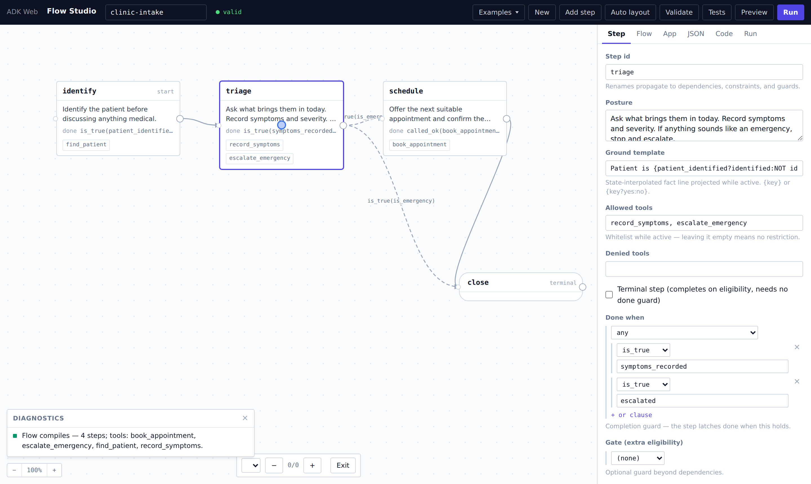
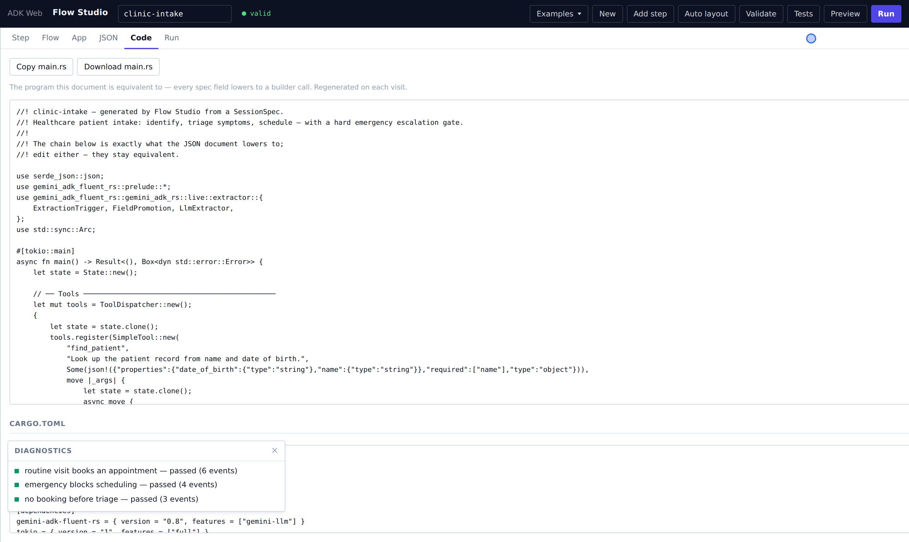

# gemini-rs

> Full Rust SDK for the Gemini Multimodal Live API — wire protocol, agent runtime, and fluent DX in three layered crates. Voice agents that are **governed, testable, and authorable as data**.

[](https://github.com/vamsiramakrishnan/gemini-rs/actions/workflows/ci.yml)
[](https://github.com/vamsiramakrishnan/gemini-rs/actions/workflows/docs.yml)
[](LICENSE)
[](https://crates.io/crates/gemini-genai-rs)
[](https://www.rust-lang.org)

**[User guide](https://vamsiramakrishnan.github.io/gemini-rs/)** ·
**[API reference](https://vamsiramakrishnan.github.io/gemini-rs/api/gemini_genai_rs/index.html)** ·
**[Cookbook (40 examples)](https://vamsiramakrishnan.github.io/gemini-rs/cookbooks.html)** ·
**[Flow Studio](#flow-studio--build-governed-agents-visually)**

<p align="center"></p>

<p align="center"><em>Flow Studio — the drag-and-drop editor for governed sessions. Everything it does, the SDK does in code or JSON.</em></p>

---

## A voice agent in five lines

```rust
use gemini_adk_fluent_rs::prelude::*;

Live::builder()
    .instruction("You are a helpful concierge.")
    .greeting("Greet the caller.")
    .connect_from_env().await?     // Google AI or Vertex — resolved from env
    .talk().await?;                // microphone in, speakers out, barge-in handled
```

`connect_from_env()` reads `GEMINI_API_KEY` (Google AI) or the
`GOOGLE_GENAI_USE_VERTEXAI` / `GOOGLE_CLOUD_PROJECT` variables (Vertex AI) —
no auth ceremony. `talk()` (feature `voice-io`) runs the full duplex audio
loop on the default devices: resampling both directions, interruptions
flushing the speaker buffer instead of playing stale audio.

The same session, **governed** — a declarative DAG the runtime enforces live,
with deterministic extraction filling its guards and an agent orchestrated on
step entry:

```rust
let flow = Flow::new()
    .step("collect").done(Guard::captured(["party_size", "slot"]))
    .step("check").after("collect")
        .ground("Party of {party_size} at {slot}; availability: {check:result}.")
        .done(Guard::resolved("check"))
    .step("book").after("check").allow(["book"]).done(Guard::called_ok("book"))
    .never("book").until(Guard::resolved("check")).once("book")
    .build()?;

Live::builder()
    .govern(flow)                                            // enforce the DAG
    .extract_record(Booking::extract())                      // #[derive(Extract)] — CPU recognizers, no model
    .on_enter("check", availability_agent, AgentMode::Call)  // result → check:result
    .connect_from_env().await?
    .talk().await?;
```

And the same session **as data** — a JSON document that validates, simulates,
tests, and code-generates without an API key ([format reference](https://vamsiramakrishnan.github.io/gemini-rs/user-guide/flow-json.html)):

```json
{
  "name": "booking",
  "instruction": "You take table reservations.",
  "tools": [{ "name": "book", "description": "Commit the booking",
              "response": { "ok": true }, "set_state": { "booked": true } }],
  "flow": {
    "steps": [
      { "id": "collect", "done": { "captured": ["party_size", "slot"] } },
      { "id": "book", "after": ["collect"], "allow": ["book"],
        "done": { "called_ok": "book" } }
    ],
    "constraints": [{ "once": "book" }]
  },
  "tests": [{ "name": "happy path", "script": [
    { "set": { "party_size": 4, "slot": "19:00" } },
    { "tool": "book" },
    { "expect": { "done": ["collect", "book"] } }
  ]}]
}
```

`SessionSpec::validate()` compiles it (with did-you-mean diagnostics on state
keys), `simulate` replays the embedded tests through the real flow monitor,
`apply()` configures a live session from it, and `to_rust()` prints the
equivalent fluent program.

---

## Choose your altitude

<p align="center"></p>

| Crate | Layer | You want it when… |
|-------|-------|-------------------|
| [`gemini-adk-fluent-rs`](crates/gemini-adk-fluent-rs) | **L2 — Fluent DX** | You're building an application. `Live::builder()`, `AgentBuilder`, operator algebra, `SessionSpec`, voice I/O, telephony. **Start here.** |
| [`gemini-adk-rs`](crates/gemini-adk-rs) | **L1 — Agent runtime** | You're building custom processors or need the runtime directly: `State`, phases, tool dispatch, `Flow`, extraction, watchers, combinators, telemetry. |
| [`gemini-genai-rs`](crates/gemini-genai-rs) | **L0 — Wire protocol** | You need raw WebSocket access, custom transports, or the feature-gated REST APIs (`generate`, `embed`, `files`, …). |

Each layer depends only on the one below; every layer is independently usable.
The L2 `prelude` is a curated kernel (~40 types); everything else lives in
focused submodules (`live`, `text`, `tools`, `state`, `flow`, `agents`, `llm`,
`spec`, `voice`, `telephony`, `wire`). Plus
[`gemini-memory-rs`](crates/gemini-memory-rs) — a contextual memory engine for
Live sessions (OKF Markdown memory, local BM25 retrieval, session
reconciliation), independent of the stack.

See **[The Layer Contract](https://vamsiramakrishnan.github.io/gemini-rs/user-guide/layers.html)** —
each layer's promises are named in code (`primitives` modules) and enforced by
compile-time drift tests.

---

## What's in the box

Every capability below is production code with tests, a book chapter, and in
most cases a runnable example.

| Capability | One line | Book chapter |
|------------|----------|--------------|
| **Live voice sessions** | Full-duplex audio/text with typed callbacks on a three-lane processor (fast / control / telemetry) | [Live Sessions](https://vamsiramakrishnan.github.io/gemini-rs/user-guide/live-sessions.html) · [Callbacks](https://vamsiramakrishnan.github.io/gemini-rs/user-guide/live-callbacks.html) |
| **Governed flows** | One declarative DAG gates tools, steers the model per step, and explains itself (`Guard` truth traces) | [Governed Flows](https://vamsiramakrishnan.github.io/gemini-rs/user-guide/flow.html) |
| **Sessions as JSON** | `SessionSpec`: the whole session as one document — validate, simulate, test, codegen, run | [Flows as JSON](https://vamsiramakrishnan.github.io/gemini-rs/user-guide/flow-json.html) |
| **Flow Studio** | Drag-and-drop editor over `SessionSpec` with offline test replay and live runs | [Flow Studio](#flow-studio--build-governed-agents-visually) |
| **Extraction** | Deterministic CPU recognizers (`#[derive(Extract)]`) + out-of-band LLM extractors + async field resolvers | [Extraction](https://vamsiramakrishnan.github.io/gemini-rs/user-guide/extraction.html) |
| **Phases & steering** | Guard-based conversation phases; instruction update vs context injection vs hybrid steering | [Phases](https://vamsiramakrishnan.github.io/gemini-rs/user-guide/phases.html) · [Steering](https://vamsiramakrishnan.github.io/gemini-rs/user-guide/steering-modes.html) |
| **State** | Concurrent typed KV spine with prefix scopes, typed keys, computed variables, delta tracking | [State](https://vamsiramakrishnan.github.io/gemini-rs/user-guide/state.html) |
| **Watchers & temporal patterns** | React to state changes, sustained conditions, and N-turn patterns — watchers can steer the model | [Watchers](https://vamsiramakrishnan.github.io/gemini-rs/user-guide/watchers.html) |
| **Tools** | `TypedTool` (schema from Rust types), per-tool policies (`confirm`/`timeout`/`cached`), background execution, MCP servers | [Tools](https://vamsiramakrishnan.github.io/gemini-rs/user-guide/tools.html) · [Policies](https://vamsiramakrishnan.github.io/gemini-rs/user-guide/tool-policies.html) · [MCP](https://vamsiramakrishnan.github.io/gemini-rs/user-guide/mcp-tools.html) |
| **Telephony** | Answer real phone calls: Twilio Media Streams connector, or a carrier-free in-process SIP agent (G.711/RTP/SDP) | [Telephony](https://vamsiramakrishnan.github.io/gemini-rs/user-guide/telephony.html) |
| **Voice I/O** | Device-independent duplex `pump()` + `talk()` on cpal — barge-in as an explicit `Flush` | [Layers](https://vamsiramakrishnan.github.io/gemini-rs/user-guide/layers.html) |
| **Text agents** | Combinator pipelines (`>>` `\|` `/` `*`) over an LLM core, dispatchable from live sessions | [Text Agents](https://vamsiramakrishnan.github.io/gemini-rs/user-guide/text-agents.html) · [Orchestration](https://vamsiramakrishnan.github.io/gemini-rs/user-guide/orchestration.html) |
| **Composition algebra** | Eight namespaces — `S` state, `C` context, `T` tools, `P` prompt, `M` middleware, `A` artifacts, `E` eval, `G` guards | [Composition](https://vamsiramakrishnan.github.io/gemini-rs/user-guide/composition.html) · [Middleware](https://vamsiramakrishnan.github.io/gemini-rs/user-guide/middleware.html) |
| **Persistence & repair** | Session snapshots (fs/memory/custom), resumption, conversation repair nudges | [Persistence](https://vamsiramakrishnan.github.io/gemini-rs/user-guide/session-persistence.html) |
| **Durable memory** | `gemini-memory-rs`: remembered facts projected into governed state, declaratively bound in a spec | [crate README](crates/gemini-memory-rs) |
| **Observability** | Auto-collected session signals in state + lock-free telemetry counters; record & replay | [Record & Replay](https://vamsiramakrishnan.github.io/gemini-rs/user-guide/record-replay.html) |

---

## Flow Studio — build governed agents visually

`cargo run -p gemini-adk-web-rs` → **http://localhost:25125/flows**

Flow Studio is a design surface over `SessionSpec`: everything you do on the
canvas is the JSON document, and everything in the document is the fluent Rust
program. No Studio-only semantics exist.

| | |
|---|---|
|  |  |
| **Canvas** — drag-and-drop DAG with conditional edges (dashed, guard-labeled), joins, and reset loops. Server-side compile diagnostics on every change. | **Structured editors** — posture, ground templates, tool allow/deny lists, closed-vocabulary guard editors with state-key autocomplete. |
|  |  |
| **Tests & Preview** — every cookbook embeds conformance tests; replay them through the real flow monitor and scrub event-by-event, offline, no API key. | **Code** — the generated `main.rs` + `Cargo.toml` the document lowers to. Generated cookbook apps compile under `-D warnings`. |

Six industry cookbooks ship in the gallery (healthcare intake, debt
collection, telecom support, call screening, returns desk, table booking),
each with embedded tests that run in CI. The **Run** tab drives a live session
against the canvas: active steps light up, guard truth trees show exactly
which atom a stuck step is waiting on, and postures can be edited mid-session.

---

## Answer a phone call

**Via Twilio** (Media Streams over WebSocket — the SDK bridges G.711 μ-law to
the session's voice pump; barge-in becomes Twilio's `clear`, DTMF lands in
state where flow guards read it):

```rust
use gemini_adk_fluent_rs::telephony::twilio::TwilioCall;

let mut call = TwilioCall::attach(&session);
loop {
    tokio::select! {
        Some(Ok(Message::Text(text))) = ws.recv() =>
            { if call.from_twilio.send(text).await.is_err() { break; } }
        Some(frame) = call.to_twilio.recv() => ws.send(Message::Text(frame)).await?,
        else => break,
    }
}
```

**Or with no carrier at all** (feature `sip`): an in-process SIP agent over
[rsipstack] — SDP negotiation, symmetric RTP, and G.711 handled inside the
SDK. Any softphone, PBX extension, or SIP trunk dials it directly:

```rust
use gemini_adk_fluent_rs::telephony::sip::SipAgent;

let mut agent = SipAgent::bind("0.0.0.0:5060".parse()?).await?;
while let Some(incoming) = agent.next_call().await {
    let session = Live::builder()
        .instruction("Answer the phone politely.")
        .greeting("Greet the caller.")
        .connect_from_env().await?;
    let call = incoming.answer(&session).await?;   // SDP answer + RTP starts
    tokio::spawn(async move { call.ended().await; });
}
```

Runnable ends: [`examples/telephony`](examples/telephony) (Twilio webhook +
media WS) and [`examples/sip-agent`](examples/sip-agent) (dial
`sip:gemini@<host>` from Linphone/Zoiper). Full guide:
[Telephony](https://vamsiramakrishnan.github.io/gemini-rs/user-guide/telephony.html).

[rsipstack]: https://github.com/restsend/rsipstack

---

## Quick start

```bash
cargo add gemini-adk-fluent-rs            # applications (L2 re-exports L1+L0)
export GEMINI_API_KEY="your-key"          # or Vertex: GOOGLE_GENAI_USE_VERTEXAI=true + project vars
```

**Text session:**

```rust
use gemini_adk_fluent_rs::prelude::*;

#[tokio::main]
async fn main() -> Result<(), Box<dyn std::error::Error>> {
    let handle = Live::builder()
        .model(GeminiModel::Gemini2_0FlashLive)
        .instruction("You are a friendly assistant.")
        .on_text(|t| print!("{t}"))
        .on_turn_complete(|| async { println!("\n---") })
        .connect_from_env()
        .await?;

    handle.send_text("What is the speed of light?").await?;
    tokio::signal::ctrl_c().await?;
    handle.disconnect().await?;
    Ok(())
}
```

**Voice session with the full control plane:**

```rust
let handle = Live::builder()
    .model(GeminiModel::Custom("models/gemini-2.5-flash-native-audio-preview-12-2025".into()))
    .voice(Voice::Kore)
    .instruction("You are a weather assistant.")
    .greeting("Greet the user and ask how you can help.")
    .tools(dispatcher)                     // TypedTool: schema derived from Rust types
    .transcription(true, true)
    .thinking(1024).include_thoughts()     // Google AI only; auto-stripped on Vertex
    .on_audio(|pcm| { let _ = speaker.try_send(pcm.clone()); })
    .on_input_transcript(|t, is_final| if is_final { println!("[user] {t}") })
    .on_interrupted(|| async { playback.flush().await })
    .connect_from_env()
    .await?;
```

**Wire level only (L0):**

```rust
use gemini_genai_rs::prelude::*;

let session = gemini_genai_rs::quick_connect("API_KEY", "gemini-2.0-flash-live-001").await?;
session.send_text("Hello").await?;
let mut events = session.subscribe();
while let Ok(event) = events.recv().await {
    if let SessionEvent::TextDelta(ref t) = event { print!("{t}"); }
    if let SessionEvent::TurnComplete = event { break; }
}
```

Both platforms are first-class: Google AI (API key) and Vertex AI (binary
frames, `v1beta1`, endpoint quirks) are handled by the same code, and
platform-specific features (thinking, async tool calling) are auto-stripped
where unsupported. See
[Authentication & Connecting](https://vamsiramakrishnan.github.io/gemini-rs/user-guide/auth-and-connecting.html).

---

## Examples

```bash
cp .env.example .env                      # set GEMINI_API_KEY or Vertex vars

cargo run -p example-cookbook --bin 37-governed-flow   # no credentials needed
cargo run -p gemini-adk-web-rs                         # Web UI + Flow Studio → :25125
cargo run -p text-chat                                 # standalone demos → :3001…
```

| Where | What |
|-------|------|
| [`examples/cookbook`](examples/cookbook) | **40 progressive binaries** — Crawl (builders, combinators, algebra) → Walk (multi-agent patterns) → Run (advanced) → **Governed** (`37`–`40`: Flow, Extract, orchestration capstones; run with no credentials) |
| [`apps/gemini-adk-web-rs`](apps/gemini-adk-web-rs) | Multi-app Web UI: 13 showcase apps (voice chat, guardrails, playbook, clinic, debt collection, …) with a shared DevTools panel — plus **Flow Studio** at `/flows` |
| [`examples/telephony`](examples/telephony) · [`examples/sip-agent`](examples/sip-agent) | Phone agents: Twilio Media Streams / carrier-free SIP |
| [`examples/voice-chat`](examples/voice-chat) · [`text-chat`](examples/text-chat) · [`tool-calling`](examples/tool-calling) · [`transcription`](examples/transcription) · [`agents`](examples/agents) | Focused standalone demos per layer |
| [`examples/INDEX.md`](examples/INDEX.md) | The full annotated index |

---

## Documentation

- **[The book](https://vamsiramakrishnan.github.io/gemini-rs/)** — 30+ chapters:
  getting started, architecture, every subsystem in depth, troubleshooting,
  glossary. Built from [`docs/`](docs) and deployed on every push to `main`.
- **[API reference](https://vamsiramakrishnan.github.io/gemini-rs/api/gemini_genai_rs/index.html)** —
  rustdoc for all published crates, same site.
- **[CLAUDE.md](CLAUDE.md)** / **[GEMINI.md](GEMINI.md)** — the condensed
  agent-facing map of the codebase (also a good human cheat sheet).
- **[ROADMAP.md](ROADMAP.md)** · **[CHANGELOG.md](CHANGELOG.md)** ·
  **[CONTRIBUTING.md](CONTRIBUTING.md)**

---

## Development

```bash
cargo build --workspace                   # build everything
cargo test  --workspace                   # ~2,500 tests, no API key required
cargo clippy --workspace --all-targets -- -D warnings
cargo fmt --all -- --check
mdbook build docs                         # the book (mdbook 0.4+)
```

System deps (Linux): `pkg-config libssl-dev build-essential`, plus
`libasound2-dev` for the opt-in `voice-io` feature. Opt-in features on L2:
`voice-io` (cpal devices), `sip` (in-process SIP agent), `http-tools`
(declarative HTTP tool bindings). Releases go through `just release <version>`
(branch → validate → publish L0→L1→L2 → GitHub Release); see
[CONTRIBUTING.md](CONTRIBUTING.md).

```
crates/   gemini-genai-rs (L0) · gemini-adk-rs (L1) · gemini-adk-fluent-rs (L2) · gemini-memory-rs
apps/     gemini-adk-web-rs (Web UI + Flow Studio) · gemini-adk-api-rs (REST server)
examples/ cookbook (40) · telephony · sip-agent · voice-chat · text-chat · tool-calling · transcription · agents
tools/    gemini-adk-cli-rs · gemini-adk-transpiler-rs
```

---

## License

MIT — see [LICENSE](LICENSE).
