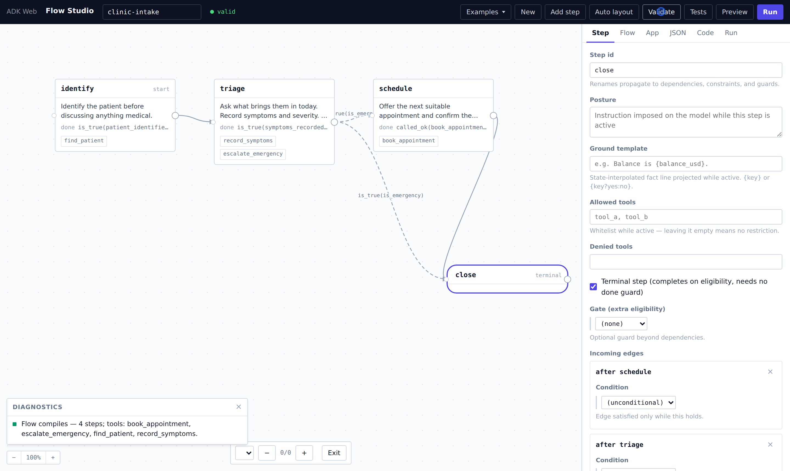
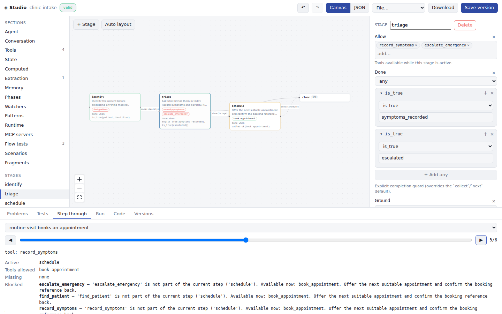

# gemini-rs

### The model improvises. The conversation must not.

[](https://github.com/vamsiramakrishnan/gemini-rs/actions/workflows/ci.yml)
[](https://github.com/vamsiramakrishnan/gemini-rs/actions/workflows/docs.yml)
[](https://crates.io/crates/gemini-genai-rs)
[](rust-toolchain.toml)
[](LICENSE)

**v0.8 · pre-1.0 · MIT** · [book](https://vamsiramakrishnan.github.io/gemini-rs/) · [API reference](https://vamsiramakrishnan.github.io/gemini-rs/api/gemini_genai_rs/index.html)

A live voice model will happily book the table before checking availability, charge the card before verifying identity, and skip the disclosure it was told to read. Not because the prompt was wrong — because a prompt is advice, and advice is not enforcement.

The usual fix is a longer prompt. The longer prompt is also advice.

gemini-rs is a full Rust SDK for the Gemini Multimodal Live API that treats the conversation as a contract. You declare the flow — steps, completion guards, tool gates, ordering constraints — and the runtime enforces it while the model speaks: a tool the flow has not admitted does not execute, whatever the model intends. The same contract is a JSON document you can validate, simulate, test, and code-generate offline, and a canvas you can edit by hand.

## Five lines to try it

```rust
Live::builder()
    .instruction("You are a helpful concierge.")
    .greeting("Greet the caller.")
    .connect_from_env().await?     // GEMINI_API_KEY, or Vertex env vars
    .talk().await?;                // mic in, speakers out, barge-in handled
```

`cargo add gemini-adk-fluent-rs --features voice-io`, export `GEMINI_API_KEY`, done. `talk()` (feature `voice-io`; Linux needs `libasound2-dev`) runs the duplex audio loop on the default devices; an interruption flushes the speaker buffer instead of playing stale speech. `connect_from_env()` resolves Google AI vs Vertex AI from the environment — both platforms, one code path, unsupported wire fields stripped automatically.

## One call, walked through

`examples/voice-spec-demo` places a real phone-style call with no human in the room: Gemini TTS plays the caller, Gemini Live answers as the agent, and one JSON document governs the agent. The document is the restaurant cookbook from the Flow Studio gallery, edited by hand — because the document the Studio edits is just JSON.

```text
$ cargo run -p example-voice-spec-demo
spec `trattoria-voice` valid: true
  embedded test `party books a table`: passed (6 events)
  embedded test `no booking before availability`: passed (3 events)
connected: models/gemini-2.5-flash-native-audio-preview-12-2025
  [flow] done: [] · active: [gather] · admitted tools: [capture_party]
[caller] Hi! I'd like a table for two tomorrow at seven in the evening.
  [flow] done: [check, gather] · active: [book] · admitted tools: [book_table]
[caller] Seven thirty works perfectly. Please book it.
  [flow] done: [book, check, farewell, gather] · active: []
wrote voice-spec-demo.wav — 27.3s of call audio
```

Read the trace, not the adjectives. Before the call, the document's embedded tests replay through the real flow monitor — offline, no API key. During the call, `book_table` is not admitted until an availability check has actually run; the constraint `never book_table until availability_checked` is enforced by the runtime, not requested of the model. The full log is checked in at [`examples/voice-spec-demo/run-receipt.txt`](examples/voice-spec-demo/run-receipt.txt); the document is [`spec.json`](examples/voice-spec-demo/spec.json) beside it.

The contract, in the fluent phrasing:

```rust
let flow = Flow::new()
    .step("gather").allow(["capture_party"])
        .done(Guard::captured(["party_size", "requested_time"]))
    .step("check").after("gather").allow(["check_availability"])
        .done(Guard::is_true("availability_checked"))
        .ground("Party of {party_size}.")
    .step("book").after("check").allow(["book_table"])
        .done(Guard::called_ok("book_table"))
    .step("farewell").after("book").terminal()
    .once("book_table")
    .never("book_table").until(Guard::is_true("availability_checked"))
    .build()?;

Live::builder().govern(flow).connect_from_env().await?.talk().await?;
```

Guards are a closed, serializable vocabulary — `is_true`, `captured`, `called_ok`, `resolved`, composed with any/all — which is why the same flow round-trips between Rust, JSON, and the canvas without loss, and why a stuck step can explain itself: the runtime prints the truth value of every atom it is waiting on.

## The document is the program

Everything a session is — flow, tools (mock, HTTP, MCP), extraction schemas, phases, watchers, computed state, memory slots, runtime tuning, and its own test suite — serializes into one `SessionSpec` document. `validate()` compiles it with did-you-mean diagnostics on state keys. `simulate` replays the embedded tests. `to_rust()` prints the equivalent fluent program; generated cookbook apps compile under `-D warnings`. Nothing here is Studio magic: the Studio is one client of the document.

<p align="center"></p>

The Flow Studio (`cargo run -p gemini-adk-web-rs` → `/flows`) is the same document on a canvas. Conditional edges render dashed with their guard as the label; the badge is the compiler's verdict; the Preview scrubber is the offline simulator driving the canvas; the Code tab is `to_rust()`.

<p align="center"></p>

<p align="center"></p>

Six industry cookbooks ship in the gallery — healthcare intake, debt collection, telecom support, call screening, returns desk, table booking — each with embedded conformance tests. A CI test walks the gallery and requires every cookbook to compile and pass its own tests. The tour lives in [the Flow Studio chapter](https://vamsiramakrishnan.github.io/gemini-rs/flow-studio.html).

## The expensive callback is the one that blocks

Live audio does not wait. Every session event is routed through three lanes with different latency contracts: a **fast lane** (sync, sub-millisecond — audio chunks, text deltas, transcripts, VAD), a **control lane** (async — tool calls, turn boundaries, extraction, phase transitions), and a **telemetry lane** (lock-free counters, off the hot path). The fast-lane contract is enforced by convention and documented per callback; a blocked audio callback costs the conversation, so hooks that need to block get a `_concurrent` variant that detaches instead.

The same discipline shapes the audio path. `voice::pump()` is the device-independent duplex core: feed microphone frames at any sample rate on one channel, receive playback at any rate on another, and an interruption arrives as an explicit `Playback::Flush` — stale audio is dropped, never played. `talk()` is `pump()` on cpal devices. Telephony is `pump()` on a phone line.

## A phone line is just another pump

Two runnable ends, one audio core:

**Twilio Media Streams** — the SDK speaks the protocol and bridges G.711 μ-law to the session at 8 kHz; barge-in becomes Twilio's `clear`, DTMF lands in session state where flow guards read it ([`examples/telephony`](examples/telephony)).

**No carrier at all** (feature `sip`) — an in-process SIP agent over [rsipstack](https://github.com/restsend/rsipstack): SDP negotiation, symmetric RTP, G.711 inside the SDK. Any softphone or PBX extension dials it directly:

```rust
let mut agent = SipAgent::bind("0.0.0.0:5060".parse()?).await?;
while let Some(incoming) = agent.next_call().await {
    let session = Live::builder()
        .instruction("Answer the phone politely.")
        .connect_from_env().await?;
    let call = incoming.answer(&session).await?;   // SDP answer + RTP starts
    tokio::spawn(async move { call.ended().await; });
}
```

Both paths land DTMF keypresses in session state where flow guards read them — Twilio as protocol events, SIP as RFC 4733 telephone events negotiated in the SDP answer. Deliberately deferred: SIP registration and SRTP. The [telephony chapter](https://vamsiramakrishnan.github.io/gemini-rs/user-guide/telephony.html) has the decision table.

## Choose your altitude

Three crates, each depending only on the one below, each usable alone:

| Crate | Layer | The contract |
|---|---|---|
| [`gemini-adk-fluent-rs`](crates/gemini-adk-fluent-rs) | L2 · authoring | Two equivalent phrasings — fluent chain and JSON document. Never invents runtime semantics. |
| [`gemini-adk-rs`](crates/gemini-adk-rs) | L1 · runtime | State, flows, tools, extraction, phases, watchers. Gives meaning and enforcement; never hides a decision. |
| [`gemini-genai-rs`](crates/gemini-genai-rs) | L0 · wire | A duplex authenticated frame stream, both platforms. Never interprets the conversation. |

Each layer's promise is named in code — `primitives` modules with compile-time drift tests, so a renamed or removed primitive breaks the contract at build time, not in a reader's mental model. [`gemini-memory-rs`](crates/gemini-memory-rs) sits beside the stack: durable memory as human-readable Markdown, prepared asynchronously, consumed synchronously, projected into governed state where guards read it.

Beyond flows, the L1/L2 surface covers the rest of a production session: typed tools with schemas derived from Rust types, per-tool policies (`confirm`/`timeout`/`cached`), background tool execution, MCP servers, out-of-band LLM extraction plus deterministic CPU recognizers (`#[derive(Extract)]` — no model in the control loop), phases with three steering modes, state watchers and temporal patterns, session persistence and repair, and text-agent combinators (`>>` `|` `/` `*`) with an eight-namespace composition algebra. Every one has a [book chapter](https://vamsiramakrishnan.github.io/gemini-rs/).

## What the tests hold

- 2,500+ workspace tests, none requiring an API key — including G.711 codec conformance against known wire values, RTP wire layouts, SDP offer/answer round-trips, a raw-UDP SIP signalling integration test, guard truth-trace suites, and codegen goldens.
- Every gallery cookbook compiles through the real flow compiler and passes its own embedded tests, in CI.
- Generated apps compile as standalone crates under `RUSTFLAGS="-D warnings"`.
- Layer contracts are drift-tested; docs build with `RUSTDOCFLAGS="-D warnings"`.

```bash
cargo test --workspace          # ~2,500 tests, no credentials
cargo run -p example-cookbook --bin 37-governed-flow    # governed flow, no credentials
cargo run -p gemini-adk-web-rs  # Web UI + Flow Studio → :25125
```

[`examples/`](examples/INDEX.md) holds 40 progressive cookbook binaries (builders → combinators → multi-agent → governed capstones), the telephony and SIP agents, the TTS-driven call above, and focused per-layer demos. [`apps/gemini-adk-web-rs`](apps/gemini-adk-web-rs) bundles 13 showcase apps with a shared DevTools panel.

## Documentation

The [book](https://vamsiramakrishnan.github.io/gemini-rs/) is the reference — 30+ chapters from setup to the layer contract, deployed from [`docs/`](docs) on every push to `main`, with the merged [rustdoc API reference](https://vamsiramakrishnan.github.io/gemini-rs/api/gemini_genai_rs/index.html) beside it. [CLAUDE.md](CLAUDE.md) is the condensed map of the codebase. [ROADMAP.md](ROADMAP.md) says what is deliberately not built yet.

Building locally: Rust 1.93+, `pkg-config libssl-dev` (plus `libasound2-dev` for `voice-io`); `cargo build --workspace`; `mdbook build docs` for the book. Releases go through `just release <version>` — see [CONTRIBUTING.md](CONTRIBUTING.md).

## License

MIT — see [LICENSE](LICENSE).
