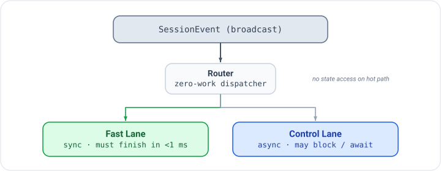

# Live Session Callbacks

Callbacks are how your application reacts to events from the Gemini Live API.
The SDK routes events through two lanes with distinct performance contracts, and
a third telemetry lane for usage metadata. Understanding the lanes prevents the
most common audio-quality and deadlock bugs.

## The Two-Lane Model

<p align="center"></p>

The router receives every incoming WebSocket event and dispatches it to the
appropriate lane. It does zero work itself — no state reads, no allocations.

**Fast lane** callbacks are invoked synchronously on the dispatch thread. They
must complete in under 1 ms. No allocations, no mutex locks, no async work. A
channel `try_send` is acceptable; a channel `send` that can block is not.

**Control lane** callbacks run in a dedicated async task. They may perform I/O,
read shared state, call async functions, or do any other async work. Most
control-lane callbacks have a `_concurrent` variant that spawns the body as a
detached tokio task instead of blocking the control loop.

## Fast-Lane Callbacks (sync, `<1 ms`)

Register these with the synchronous closure variants on `Live::builder()`.

| Setter | Signature | Description |
|--------|-----------|-------------|
| `.on_audio(f)` | `f: Fn(&Bytes)` | Raw PCM audio chunk from the model (PCM16, 24 kHz, mono). Forward to a speaker buffer or channel. |
| `.on_text(f)` | `f: Fn(&str)` | Incremental text delta as the model generates. Suitable for streaming display. |
| `.on_text_complete(f)` | `f: Fn(&str)` | Full accumulated text for the current generation, delivered once per turn boundary. |
| `.on_input_transcript(f)` | `f: Fn(&str, bool)` | ASR transcript of the user's speech. Second argument is `is_final`. |
| `.on_output_transcript(f)` | `f: Fn(&str, bool)` | Transcript of the model's audio output. Second argument is `is_final`. |
| `.on_thought(f)` | `f: Fn(&str)` | Thought summary chunk. Requires `.include_thoughts()`. Google AI only. |
| `.on_vad_start(f)` | `f: Fn()` | Server-side VAD detected voice activity start. |
| `.on_vad_end(f)` | `f: Fn()` | Server-side VAD detected voice activity end. |
| `.on_phase(f)` | `f: Fn(SessionPhase)` | Session lifecycle phase changed (connecting, active, disconnecting, etc.). Use for lightweight UI state updates. |
| `.on_usage(f)` | `f: Fn(&UsageMetadata)` | Token usage delivered after each generation. Fires on the telemetry lane (not the audio hot path), but shares the sync-only constraint. |

### Partial and Final Transcript Semantics

Both `on_input_transcript` and `on_output_transcript` implement a streaming
ASR pattern:

- While speech is in progress, callbacks fire repeatedly with `is_final = false`.
  Each delivery is the server's current best guess; earlier partial results may
  be revised.
- At the turn boundary, a single callback fires with `is_final = true` carrying
  the complete, finalized transcript for the turn.

Only the `is_final = true` delivery is suitable for storage, downstream
processing, or display in a permanent transcript. Use `is_final = false`
deliveries for a live "typing" indicator or real-time captions.

```rust,ignore
.on_input_transcript(|text, is_final| {
    if is_final {
        println!("User said: {text}");  // commit to transcript
    } else {
        // update live caption display
    }
})
.on_output_transcript(|text, is_final| {
    if is_final {
        println!("Model said: {text}");
    }
})
```

### The `<1 ms` Rule in Practice

```rust,ignore
// OK: try_send never blocks
.on_audio(|data| {
    playback_tx.try_send(data.clone()).ok();
})

// OK: atomic store
.on_vad_start(|| {
    is_speaking.store(true, Ordering::Relaxed);
})

// BAD: blocking send can stall the audio pipeline
.on_audio(|data| {
    blocking_channel.send(data.clone()).unwrap(); // DO NOT DO THIS
})

// BAD: async work requires spawning, not direct await
.on_text(|text| {
    // Cannot .await here — the closure is sync
    database.insert(text).await;  // compile error anyway
})
```

## Control-Lane Callbacks (async, may block)

These are registered with async-closure variants. The control lane awaits each
blocking callback in sequence; concurrent variants are spawned as detached tasks.

### Lifecycle Callbacks

| Setter | Signature | Description |
|--------|-----------|-------------|
| `.on_connected(f)` | `f: Fn(Arc<dyn SessionWriter>) -> impl Future` | Fires when the WebSocket setup completes. The `SessionWriter` can be cloned and stored for sending messages from outside callbacks. |
| `.on_disconnected(f)` | `f: Fn(Option<String>) -> impl Future` | Fires on disconnect. `Some(msg)` indicates an error close; `None` is a clean close. |
| `.on_go_away(f)` | `f: Fn(Duration) -> impl Future` | Server sent a GoAway signal with a time-to-disconnect hint. Save state and prepare for reconnect. |
| `.on_resumed(f)` | `f: Fn() -> impl Future` | Fires after a session resumes from a persisted snapshot. Use to re-subscribe to external streams or reset UI state. Requires `.persistence(...)` on the builder. |
| `.on_error(f)` | `f: Fn(String) -> impl Future` | Non-fatal error from the server or processor. The session continues. |
| `.on_interrupted(f)` | `f: Fn() -> impl Future` | Model output was interrupted by barge-in. Flush your playback buffer here. **Forced blocking** — no `_concurrent` variant. |

### Tool Callbacks

| Setter | Signature | Description |
|--------|-----------|-------------|
| `.on_tool_call(f)` | `f: Fn(Vec<FunctionCall>, State) -> impl Future<Output = Option<Vec<FunctionResponse>>>` | Model requested tool execution. Return `None` to use auto-dispatch (ToolDispatcher); return `Some(responses)` to override. Receives the shared session `State`. **Forced blocking** — no `_concurrent` variant (return value is the tool response). |
| `.on_tool_cancelled(f)` | `f: Fn(Vec<String>) -> impl Future` | Server cancelled pending tool calls. Argument is the list of cancelled call IDs. Use to clean up in-flight async work. |

### Turn and Generation Callbacks

| Setter | Signature | Description |
|--------|-----------|-------------|
| `.on_turn_complete(f)` | `f: Fn() -> impl Future` | Turn boundary reached — the model has finished its (possibly truncated) response for this turn. |
| `.on_generation_complete(f)` | `f: Fn() -> impl Future` | Model finished its full intended response **before** any interruption truncation. |

#### `on_generation_complete` vs `on_turn_complete`

These two callbacks mark different points in the generation lifecycle:

- **`on_generation_complete`** fires on the wire `GenerationComplete` event,
  which arrives **before** interruption truncation is applied. If the user
  interrupts mid-response, `on_generation_complete` still delivers a
  notification about the complete intended output. Pair this with
  `.extract_on_generation::<T>(llm, "...")` to run a structured extractor
  against the model's full text before truncation.

- **`on_turn_complete`** fires at the turn boundary after any truncation.
  Use this for turn-level bookkeeping: transcript commits, phase evaluation,
  extractor runs triggered by `.extract_turns()`, and downstream signals.

```rust,ignore
Live::builder()
    // Capture full intent even when user interrupts
    .extract_on_generation::<FullIntent>(llm, "Extract model's intended action")
    .on_generation_complete(|| async {
        println!("Generation complete (pre-truncation)");
    })
    // Normal turn-level work
    .on_turn_complete(|| async {
        println!("Turn complete (post-truncation)");
    })
```

### Extraction Callbacks

| Setter | Signature | Description |
|--------|-----------|-------------|
| `.on_extracted(f)` | `f: Fn(String, serde_json::Value) -> impl Future` | An out-of-band extractor produced a result. First argument is the schema type name; second is the extracted JSON value. |
| `.on_extraction_error(f)` | `f: Fn(String, String) -> impl Future` | An extractor failed. First argument is the schema type name; second is the error message. By default, extraction failures are logged via `tracing::warn!`; register this callback for custom handling. |

## Outbound Interceptors

These are not event callbacks but pipeline hooks that transform data on its way
out to Gemini. They are always blocking (no `_concurrent` variant).

### `before_tool_response`

Intercept tool responses before they are sent back to the model. Use this to
augment responses with conversation context, filter sensitive fields, or
normalize formats.

```rust,ignore
.before_tool_response(|responses, state| async move {
    let customer: Option<String> = state.get("customer_name");
    responses.into_iter().map(|mut r| {
        if let Some(name) = &customer {
            r.response["customer"] = serde_json::json!(name);
        }
        r
    }).collect()
})
```

### `on_turn_boundary`

Called at turn boundaries after extractors run but before `on_turn_complete`.
Receives the shared `State` and a `SessionWriter` for injecting content into
the conversation. Use for context stuffing, K/V injection, or condensed state
summaries.

```rust,ignore
.on_turn_boundary(|state, writer| async move {
    let summary = state.get::<String>("session_summary").unwrap_or_default();
    if !summary.is_empty() {
        writer.send_client_content(
            Content::user().text(format!("[Background context: {summary}]")),
            false,
        ).await.ok();
    }
})
```

## Instruction Interceptors

These sync callbacks allow state-reactive instruction updates without requiring
an async round-trip:

- **`instruction_template`** (on `Live::builder()` via the phases module):
  called after extractors on each `TurnComplete`; returns `Some(instruction)`
  to fully replace the current system instruction, or `None` to leave it
  unchanged.
- **`instruction_amendment`**: additive alternative — returns `Some(text)` to
  append to the phase instruction. Unlike `instruction_template`, you never
  need to repeat the base instruction text.

Both are sync closures (`Fn(&State) -> Option<String>`).

## Callback Execution Modes

Control-lane callbacks default to **Blocking** — the event loop awaits each
callback before processing the next event. Use `_concurrent` variants for
fire-and-forget work.

```rust,ignore
// Blocking (default) — ordering guarantee: turn_complete fires after
// all in-turn processing completes
.on_turn_complete(|| async {
    metrics_tx.send(TurnComplete).await.ok();
})

// Concurrent — detached task, event loop continues immediately
.on_extracted_concurrent(|name, value| async move {
    db.upsert_extraction(&name, value).await.ok();
})

.on_error_concurrent(|msg| async move {
    alerting::send_slack(&msg).await;
})

.on_disconnected_concurrent(|reason| async move {
    tracing::info!(?reason, "session disconnected");
})
```

### Forced-Blocking Callbacks

Some callbacks cannot be made concurrent because the event loop depends on their
return value or side effects:

| Callback | Reason |
|----------|--------|
| `on_interrupted` | Must clear the interrupted state before audio resumes |
| `on_tool_call` | Returns the tool responses to the model |
| `before_tool_response` | Transforms the response pipeline |
| `on_turn_boundary` | Content injection must complete before `on_turn_complete` |

## Middleware Tool Hooks

For tool-level audit logging or retry logic, register middleware via
`Live::middleware(layer)`. The `Middleware` trait provides
`before_tool` / `after_tool` / `on_tool_error` hooks in addition to
agent-level `before_agent` / `after_agent`. See the
[Middleware chapter](./middleware.md) for details.

## Worked Example

A representative session wiring a cross-section of callbacks:

```rust,ignore
use gemini_adk_fluent_rs::prelude::*;
use std::sync::atomic::{AtomicBool, Ordering};
use std::sync::Arc;

let is_speaking = Arc::new(AtomicBool::new(false));
let is_speaking2 = is_speaking.clone();

let handle = Live::builder()
    .model(GeminiModel::Gemini2_0FlashLive)
    .voice(Voice::Kore)
    .instruction("You are a customer service agent.")
    .transcription(true, true)
    .greeting("Welcome! How can I help you today?")

    // Fast lane: audio forwarded via lock-free channel
    .on_audio(move |data| {
        playback_tx.try_send(data.clone()).ok();
    })

    // Fast lane: partial/final transcripts
    .on_input_transcript(|text, is_final| {
        if is_final {
            println!("User: {text}");
        }
    })
    .on_output_transcript(|text, is_final| {
        if is_final {
            println!("Agent: {text}");
        }
    })

    // Fast lane: VAD signals for UI
    .on_vad_start(move || { is_speaking2.store(true, Ordering::Relaxed); })
    .on_vad_end(move || { is_speaking.store(false, Ordering::Relaxed); })

    // Fast lane: token usage
    .on_usage(|usage| {
        if let Some(total) = usage.total_token_count {
            println!("Total tokens used: {total}");
        }
    })

    // Control lane: flush playback on barge-in (forced blocking)
    .on_interrupted(|| async move {
        playback.flush().await;
    })

    // Control lane: tool dispatch — None means auto-dispatch via ToolDispatcher
    .on_tool_call(|calls, _state| async move { None })

    // Control lane: clean up cancelled async tool work
    .on_tool_cancelled(|ids| async move {
        for id in ids {
            tracing::warn!("Tool call {id} was cancelled");
        }
    })

    // Control lane: turn-level bookkeeping (blocking)
    .on_turn_complete(|| async {
        tracing::debug!("turn complete");
    })

    // Control lane: capture full intent before truncation
    .on_generation_complete(|| async {
        tracing::debug!("generation complete (pre-truncation)");
    })

    // Control lane: log extractions concurrently (fire-and-forget)
    .on_extracted_concurrent(|name, value| async move {
        tracing::info!(%name, %value, "extraction result");
    })

    // Control lane: log disconnects concurrently
    .on_disconnected_concurrent(|reason| async move {
        tracing::info!(?reason, "session disconnected");
    })

    .connect_from_env()
    .await?;
```

## Related Chapters

- [Authentication and Connecting](./auth-and-connecting.md) — credential
  resolution and connection methods
- [Live Sessions](./live-sessions.md) — full session configuration and the
  runtime `LiveHandle` API
- [Extraction Pipeline](./extraction.md) — structured turn-by-turn extraction
  with `on_extracted`
- [Middleware](./middleware.md) — tool-level hooks via `Live::middleware()`
