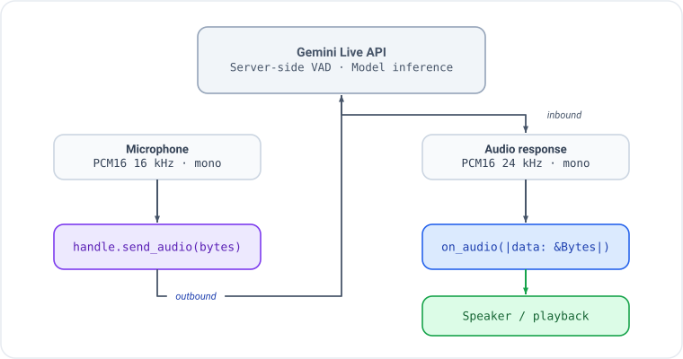
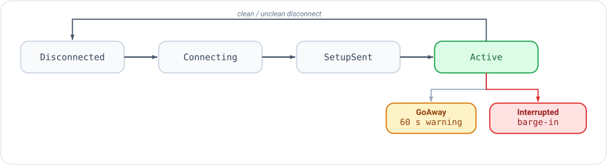

# Voice & Live Sessions

This guide covers everything you need to build voice-enabled agents with
the Gemini Multimodal Live API using gemini-genai-rs.

## What is a Live Session?

A Live Session is a full-duplex WebSocket connection to the Gemini API that
supports simultaneous audio/video input and audio/text output. Unlike the
standard `generateContent` REST API, a Live Session:

- Streams audio bidirectionally (you talk while the model talks)
- Uses server-side VAD (Voice Activity Detection) for turn management
- Supports barge-in (interrupt the model mid-sentence)
- Handles function calling inline with speech
- Maintains conversation context server-side
- Runs for up to ~10 minutes per session (with resumption support)

Audio formats:
- **Input**: PCM16, 16 kHz, mono
- **Output**: PCM16, 24 kHz, mono

## Quick Start

### Zero-ceremony with `connect_from_env()`

The recommended starting point reads platform selection and credentials from
standard environment variables — no token-fetching boilerplate required:

```rust,ignore
use gemini_adk_fluent_rs::prelude::*;

#[tokio::main]
async fn main() -> Result<(), Box<dyn std::error::Error>> {
    let handle = Live::builder()
        .instruction("You are a helpful voice assistant.")
        .on_text(|t| print!("{t}"))
        .on_turn_complete(|| async { println!() })
        .connect_from_env()
        .await?;

    handle.send_text("What is the capital of France?").await?;
    handle.done().await?;
    Ok(())
}
```

`connect_from_env()` checks `GOOGLE_GENAI_USE_VERTEXAI` to select the platform,
then resolves credentials from standard variables (`GEMINI_API_KEY` for Google
AI; `GOOGLE_CLOUD_PROJECT` + `GOOGLE_ACCESS_TOKEN` for Vertex AI, with an
automatic `gcloud auth print-access-token` fallback). See
[Authentication and Connecting](./auth-and-connecting.md) for the full
resolution rules and troubleshooting guide.

### Explicit API key

```rust,ignore
let handle = Live::builder()
    .instruction("You are a helpful voice assistant.")
    .on_text(|t| print!("{t}"))
    .on_turn_complete(|| async { println!() })
    .connect_google_ai(std::env::var("GEMINI_API_KEY")?)
    .await?;

handle.send_text("What is the capital of France?").await?;
handle.done().await?;
```

This connects to Gemini, sends a text message, prints the streamed response,
and waits for the session to end. For audio, replace `send_text()` with
`send_audio()` and add an `on_audio` callback.

## The Live Builder

`Live::builder()` returns a chainable builder that configures the entire
session. Here is the full chain with all major options:

```rust,ignore
let handle = Live::builder()
    // Model (optional — omit it and connect picks the platform default) and voice
    .model(ModelId::LIVE_2_5_FLASH_NATIVE_AUDIO)
    .voice(Voice::Kore)
    .temperature(0.7)
    .instruction("You are a restaurant order assistant.")

    // Tools (auto-dispatched when model calls them)
    .tools(dispatcher)

    // Audio/transcription config
    .transcription(true, true)   // input, output
    .affective_dialog(true)      // emotionally expressive responses

    // Server-side VAD
    .vad(AutomaticActivityDetection::default())

    // Session lifecycle
    .session_resume(true)
    .context_compression(4000, 2000)  // trigger_tokens, target_tokens

    // Greeting (model speaks first)
    .greeting("Greet the customer and ask what they'd like to order.")

    // Fast-lane callbacks (sync, <1ms)
    .on_audio(|data| { /* forward to speaker */ })
    .on_text(|t| print!("{t}"))
    .on_input_transcript(|text, _is_final| { /* display what user said */ })
    .on_output_transcript(|text, _is_final| { /* display what model said */ })
    .on_vad_start(|| { /* user started speaking */ })
    .on_vad_end(|| { /* user stopped speaking */ })

    // Telemetry callback (sync, telemetry lane)
    .on_usage(|usage| {
        if let Some(total) = usage.total_token_count {
            println!("Tokens: {total}");
        }
    })

    // Control-lane callbacks (async)
    .on_tool_call(|calls, state| async move { None })  // None = auto-dispatch
    .on_interrupted(|| async { /* flush playback buffer */ })
    .on_turn_complete(|| async { /* turn finished */ })
    .on_connected(|writer| async move { /* session ready */ })
    .on_disconnected(|reason| async move { /* session ended */ })
    .on_error(|msg| async move { eprintln!("Error: {msg}") })

    // Connect
    .connect_vertex("my-project", "us-central1", access_token)
    .await?;
```

The builder validates configuration at connect time, not at each method call.
All methods are optional except the connect method.

## Callbacks

Callbacks are split into two categories based on latency requirements. For the
full callback catalog, argument shapes, `is_final` transcript semantics,
`on_generation_complete` vs `on_turn_complete`, `_concurrent` variants, and
outbound interceptors, see [Live Callbacks](./live-callbacks.md).

### Fast Lane (Sync, `<1 ms`)

These fire on the fast lane and must complete in under 1 ms. They receive
references (not owned values) and cannot be `async`. No allocations, no mutex
locks, no blocking I/O.

```rust,ignore
// Audio: receives zero-copy Bytes
.on_audio(|data: &Bytes| {
    playback_tx.try_send(data.clone()).ok();
})

// Text: incremental deltas as the model generates
.on_text(|text: &str| { print!("{text}"); })

// Transcription: text version of audio (input or output)
// Second parameter is `is_final` — only the final delivery is suitable for storage
.on_input_transcript(|text: &str, is_final: bool| {
    if is_final { println!("User said: {text}"); }
})

// VAD: voice activity detection events from the server
.on_vad_start(|| { /* user started talking */ })
.on_vad_end(|| { /* user stopped talking */ })
```

### Control Lane (Async)

These fire on the control lane and can perform I/O, state access, or any
async work. They block the control lane while running (other control events
queue behind them). Append `_concurrent` to any setter to spawn the body as a
detached task instead.

```rust,ignore
// Interrupted: flush playback on barge-in (forced blocking)
.on_interrupted(|| async {
    playback_buffer.flush().await;
})

// Turn complete: model finished its (possibly truncated) response
.on_turn_complete(|| async {
    println!("--- turn complete ---");
})

// Generation complete: full intended response, before truncation
// Use with .extract_on_generation::<T>() for pre-interruption extraction
.on_generation_complete(|| async {
    println!("--- generation complete (pre-truncation) ---");
})

// Tool calls: return None for auto-dispatch, Some to override
.on_tool_call(|calls: Vec<FunctionCall>, state: State| async move { None })

// Error: non-fatal error (session continues)
.on_error(|msg: String| async move { eprintln!("Error: {msg}") })

// Disconnected (concurrent — fire-and-forget)
.on_disconnected_concurrent(|reason| async move {
    tracing::info!(?reason, "session disconnected");
})
```

See [Live Callbacks](./live-callbacks.md) for the complete reference including
`on_tool_cancelled`, `on_resumed`, `on_go_away`, `before_tool_response`,
`on_turn_boundary`, `on_extracted`, `on_extraction_error`, and the full list of
`_concurrent` variants.

### Tool Dispatch

When the model calls a tool, the dispatch logic follows this priority:

1. If `on_tool_call` is registered and returns `Some(responses)` -- use
   those responses.
2. If `on_tool_call` returns `None` (or is not registered) and a
   `ToolDispatcher` is set -- auto-dispatch to the registered tool, send
   the result back to the model automatically.
3. If neither -- log a warning and skip.

Register tools with the dispatcher:

```rust,ignore
use gemini_adk_rs::{SimpleTool, ToolDispatcher};

let mut dispatcher = ToolDispatcher::new();
dispatcher.register(SimpleTool::new(
    "get_weather",
    "Get current weather for a city",
    None, // JSON Schema for parameters (None = no declared schema)
    |args| async move {
        let city = args["city"].as_str().unwrap_or("unknown");
        Ok(serde_json::json!({ "city": city, "temp_c": 22, "condition": "sunny" }))
    },
));

let handle = Live::builder()
    .instruction("You are a weather assistant. Use get_weather to answer questions.")
    .tools(dispatcher)
    .on_text(|t| print!("{t}"))
    .connect_google_ai(api_key)
    .await?;
```

## Audio Pipeline

The audio pipeline for a typical voice agent:

<p align="center"></p>

Key points:

- **Input format**: PCM16, 16 kHz, mono. Send raw bytes, not base64.
  The SDK handles base64 encoding on the wire.
- **Output format**: PCM16, 24 kHz, mono. The `on_audio` callback receives
  decoded bytes ready for playback.
- **Buffer sizes**: Audio arrives in variable-size chunks. Use an
  `AudioJitterBuffer` (from L0) if you need smooth playback.
- **Barge-in**: When the user speaks while the model is responding, the
  server sends an `Interrupted` event. The fast lane sets the interrupted
  flag and stops forwarding audio; the control lane fires `on_interrupted`.

## Greeting

Use `.greeting()` to make the model speak first without waiting for user
input. The greeting prompt is sent immediately after the WebSocket setup
completes.

```rust,ignore
let handle = Live::builder()
    .voice(Voice::Kore)
    .instruction("You are a receptionist at a dental clinic.")
    .greeting("Greet the caller and ask how you can help them today.")
    .on_audio(|data| { playback_tx.send(data.clone()).ok(); })
    .connect_vertex(project, location, token)
    .await?;
// Model will immediately start speaking a greeting
```

The greeting text is sent as a user-role `client_content` message with
`turn_complete: true`, which triggers the model to generate a response.

## Transcription

Enable text transcription of audio streams to get text versions of what
the user said and what the model said:

```rust,ignore
let handle = Live::builder()
    .transcription(true, true)  // input, output
    .on_input_transcript(|text, is_final| {
        if is_final {
            println!("User: {text}");  // final, suitable for storage
        }
    })
    .on_output_transcript(|text, is_final| {
        if is_final {
            println!("Model: {text}");
        }
    })
    .connect_from_env()
    .await?;
```

Both transcript callbacks deliver intermediate partial results (`is_final =
false`) while speech is in progress, followed by a single finalized result
(`is_final = true`) at the turn boundary. Only the `is_final = true` delivery
should be persisted or processed downstream. See
[Live Callbacks — partial/final semantics](./live-callbacks.md#partial-and-final-transcript-semantics)
for details.

Transcription is required for turn extraction (`.extract_turns()`) to work.
When you add an extractor, transcription is enabled automatically.

If the user interrupts the model mid-response, `on_output_transcript` will
not receive `is_final = true` for the truncated portion. Use
`on_generation_complete` with `.extract_on_generation::<T>(...)` to capture
the model's full intended output before truncation.

## Session Lifecycle

A session progresses through these phases:

<p align="center"></p>

| Phase | Description |
|-------|-------------|
| `Disconnected` | Initial state, or after clean/unclean disconnect |
| `Connecting` | WebSocket handshake in progress |
| `SetupSent` | Setup message sent, waiting for `setupComplete` |
| `Active` | Session is live, audio/text flowing |

The `GoAway` event signals the server will disconnect soon (the
`on_go_away` callback receives the server's time-left hint as a `Duration`).
Save state and prepare to reconnect. With `.session_resume(true)`, the server
keeps issuing resumption handles; `handle.resume_handle()` returns the latest
one, which can be used to continue the conversation in a new session.

### Interacting with a Running Session

The `LiveHandle` returned by `.connect_*()` provides the runtime API:

```rust,ignore
// Send audio (raw PCM16 16kHz bytes)
handle.send_audio(pcm_bytes).await?;

// Send text
handle.send_text("What's the weather?").await?;

// Send video frame (raw JPEG bytes)
handle.send_video(jpeg_bytes).await?;

// Update system instruction mid-session
handle.update_instruction("Now focus on dessert orders.").await?;

// Read state (populated by extractors)
let order: Option<OrderState> = handle.extracted("OrderState");

// Access telemetry
let snapshot = handle.telemetry().snapshot();

// Get current session phase
let phase = handle.phase();

// Subscribe to raw events (for custom processing)
let mut events = handle.subscribe();

// Latest server-issued resumption handle (see Session Persistence guide)
let resume = handle.resume_handle();

// Graceful disconnect
handle.disconnect().await?;

// Wait for session to end naturally
handle.done().await?;
```

### Consuming Events as a Stream

`handle.stream()` exposes the semantic `LiveEvent` flow as a
`futures::Stream`, so it composes with the full `futures`/`tokio-stream`
combinator toolbox (callbacks become sugar):

```rust,ignore
use futures::StreamExt;
use gemini_adk_fluent_rs::live::LiveEvent;

let mut stream = handle.stream();
while let Some(ev) = stream.next().await {
    match ev {
        LiveEvent::TextDelta(t) => print!("{t}"),
        LiveEvent::TurnComplete => println!(),
        LiveEvent::Disconnected { .. } => break,
        _ => {}
    }
}
```

Each call to `stream()` creates an independent subscriber starting from the
current point in the event flow. A subscriber that falls behind the broadcast
buffer skips the missed events and keeps going; the stream ends when the
session's event channel closes.

## Vertex AI vs Google AI

The SDK supports both Google AI (API key) and Vertex AI (OAuth2 token)
backends. The wire protocol is the same; only the endpoint URL and
authentication differ. For the full credential-resolution rules and
troubleshooting guide, see
[Authentication and Connecting](./auth-and-connecting.md).

The easiest way to switch platforms is `connect_from_env()` with
`GOOGLE_GENAI_USE_VERTEXAI=true|false`.

### Google AI

```rust,ignore
let handle = Live::builder()
    .connect_google_ai("YOUR_API_KEY")
    .await?;
```

- Endpoint: `wss://generativelanguage.googleapis.com` (API version `v1beta`)
- Auth: API key appended as `?key={api_key}` in the WebSocket URL

### Vertex AI

```rust,ignore
// Get token via gcloud: gcloud auth print-access-token
let token = std::env::var("GOOGLE_ACCESS_TOKEN")?;

let handle = Live::builder()
    .connect_vertex("my-gcp-project", "us-central1", token)
    .await?;
```

- Endpoint: `wss://{location}-aiplatform.googleapis.com` (API version `v1beta1`)
- Auth: Bearer token in WebSocket upgrade headers
- Binary WebSocket frames (decoded automatically by the SDK)

### Pre-configured SessionConfig

For advanced scenarios (custom auth, VPC-SC private endpoints, etc.), build
the config yourself and pass it to `.connect()`:

```rust,ignore
use gemini_genai_rs::prelude::*;

let config = SessionConfig::from_endpoint(
    ApiEndpoint::vertex("my-project", "us-central1", token)
)
    .voice(Voice::Kore)
    .response_modalities(vec![Modality::Audio])
    .system_instruction("You are a helpful assistant.")
    .input_transcription(true)
    .output_transcription(true);

let handle = Live::builder()
    .on_audio(|data| { /* play audio */ })
    .connect(config)
    .await?;
```

When using `.connect(config)`, the config's `endpoint` and `model` are merged
into the builder's settings. Everything else — system instruction, tools,
voice, transcription, callbacks — is taken from the `Live` builder.

### Key Differences

| Feature | Google AI | Vertex AI |
|---------|-----------|-----------|
| Auth | API key (`?key=...`) | OAuth2 Bearer token (header) |
| API version | `v1beta` | `v1beta1` |
| Frame format | Text WebSocket frames | Binary WebSocket frames (auto-decoded) |
| Async tool calling | Supported | Not supported (fields auto-stripped) |
| Thinking config | Supported | Not supported (auto-stripped) |
| Billing | Per-token pricing | GCP billing account |
| Region | Global | Regional (e.g., `us-central1`) |
