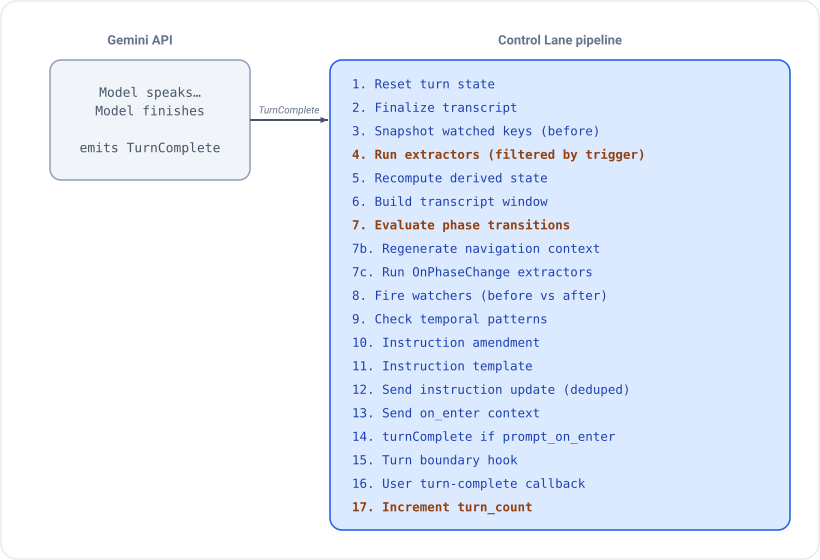
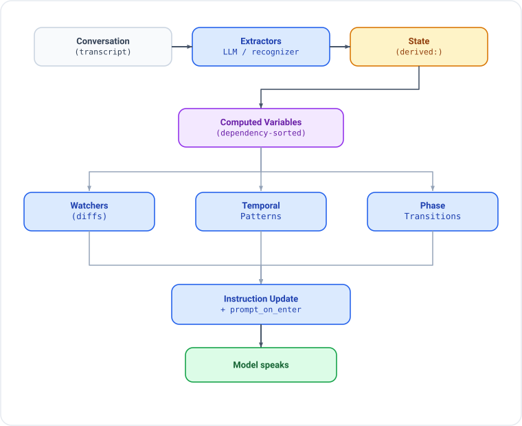
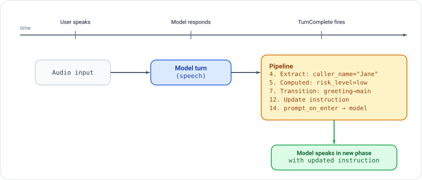
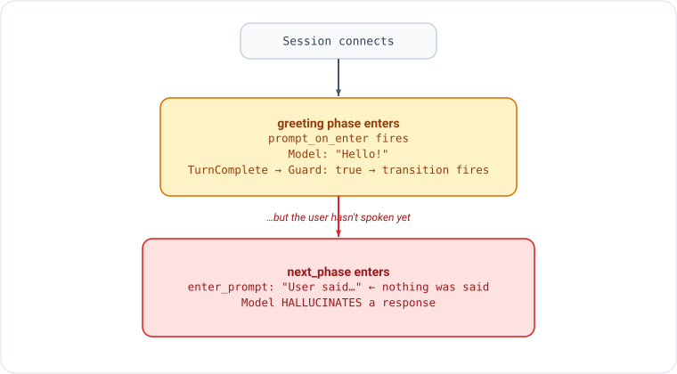
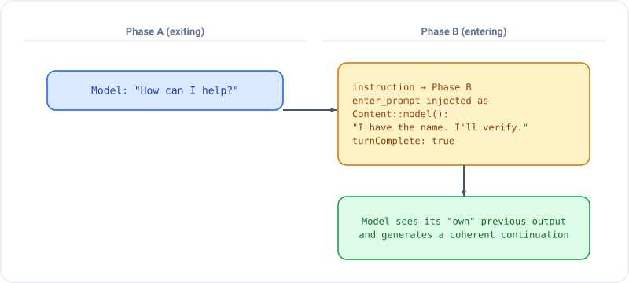
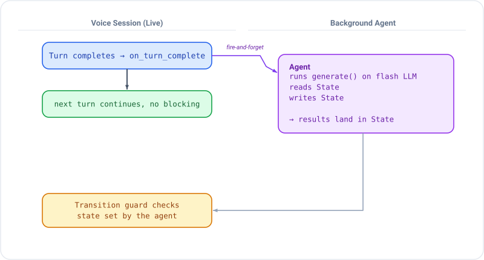
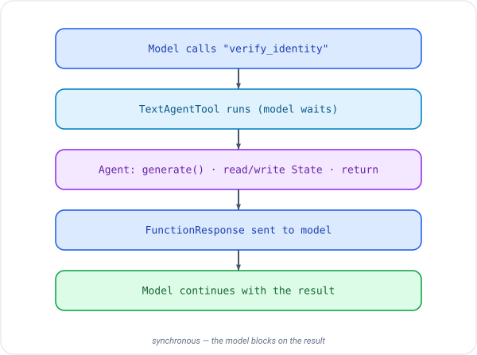
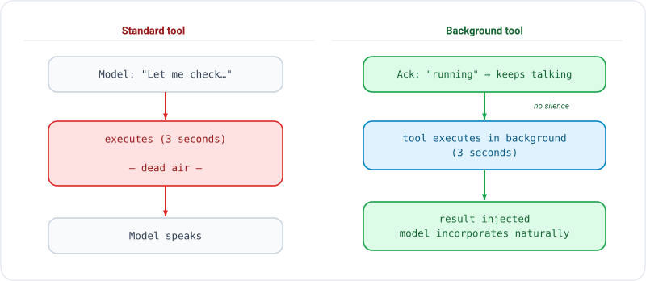

# Phase Transitions Deep Dive

How phases, state, extraction, and background agents interact in a live
voice session. This guide covers timing, data flow, and common pitfalls
with visual diagrams.

## The Turn-Complete Pipeline

Every model response ends with a `TurnComplete` event from the Gemini Live
API. This triggers a pipeline on the control lane:

<p align="center"></p>

**Key insight**: extractors (step 4) run BEFORE transitions (step 7).
This means freshly extracted state is available for transition guards.
Turn count is incremented LAST (step 17), so guards see the current
turn number, not the next one.

**Extraction triggers**: Step 4 filters extractors by their trigger mode.
`EveryTurn` extractors always run. `Interval(n)` extractors only run every
N turns. `AfterToolCall` and `OnPhaseChange` extractors are skipped here
and fire at their respective points (after tool dispatch and step 7c).

**Navigation context**: Step 7b always regenerates the navigation context
(stored in `session:navigation_context`), even if no transition fired. This
keeps the model's awareness of its position in the phase graph up to date.
Phases using `.navigation()` will include this context in the instruction.

## State Flow: Conversation to Transition

Data flows through the system in one direction per turn cycle:

<p align="center"></p>

## When Do Transitions Fire?

Transitions fire at step 7 of the turn-complete pipeline. By this point,
all extractors have run and computed variables have been recalculated.

### Timeline of a Typical Turn

<p align="center"></p>

## Transition Guards: What Works, What Doesn't

### Good: State-dependent guards

These wait for real data from the conversation:

```rust,ignore
// Wait for extraction to populate caller_name
.transition("identify", |s| s.get::<String>("caller_name").is_some())

// Wait for a boolean flag from tool execution
.transition("negotiate", S::is_true("debt_acknowledged"))

// Wait for one of several values
.transition("payment", S::one_of("intent", &["full_pay", "partial_pay"]))
```

### Bad: Unconditional guards

```rust,ignore
// BUG: fires on the FIRST turn_complete — before user speaks!
.transition("next_phase", |_s| true)
```

Why this breaks:

<p align="center"></p>

### Fix: Turn-count guards for greeting phases

```rust,ignore
.phase("greeting")
    .instruction("Welcome the caller.")
    .transition("identify", |s| {
        // Turn 0 = prompt_on_enter (no user input yet)
        // Turn 1 = greeting model response
        // Turn 2+ = user has spoken at least once
        let tc: u32 = s.session().get("turn_count").unwrap_or(0);
        tc >= 2
    })
    .done()
```

### Better: Combine turn count with state check

```rust,ignore
.transition("identify", |s| {
    let tc: u32 = s.session().get("turn_count").unwrap_or(0);
    let has_name = s.get::<String>("caller_name").is_some();
    tc >= 2 || has_name  // user spoke, or extraction already got the name
})
```

## enter_prompt: How It Works

`enter_prompt` injects a `Content::model()` message when entering a phase.
This appears in the conversation as the model's own previous speech, giving
it continuity across the phase boundary.

<p align="center"></p>

### Pitfall: False context in enter_prompt

```rust,ignore
// BAD: claims something that hasn't happened
.enter_prompt("The caller has responded with their name and reason.")

// GOOD: states the agent's intent (doesn't assert facts about the user)
.enter_prompt("I'll now verify the caller's identity.")

// BEST: state-aware prompt that reflects actual state
.enter_prompt_fn(|state, _tw| {
    let name: String = state.get("caller_name").unwrap_or_default();
    format!("The caller identified as {name}. I'll check our records.")
})
```

## Phase Transition + Extraction Interplay

The most common pattern: extractors populate state, transitions check it.

```
  Turn 1: User says "Hi, I'm Jane Smith from Acme Corp"
  ─────────────────────────────────────────────────────

  Model responds: "Hello Jane! How can I help?"

  TurnComplete fires:
    Step 4 ─ LlmExtractor runs ──> caller_name="Jane Smith"
                                    caller_org="Acme Corp"
                                    intent="unknown"

    Step 5 ─ Computed vars ──────> is_known_contact=true (lookup)

    Step 7 ─ Transitions:
             greeting guard: caller_name.is_some() ── true!
             ──> transition to identify_purpose

    Step 12 ─ Instruction update: "Ask Jane why she's calling"
    Step 14 ─ prompt_on_enter ──> model speaks in new phase
```

### What happens when extraction fails

```
  Turn 1: User says "Hi, I'm Jane Smith"
  ─────────────────────────────────────────

  TurnComplete fires:
    Step 4 ─ LlmExtractor FAILS (401 auth error)
             ──> on_extraction_error callback fires
             ──> NO state written

    Step 7 ─ Transitions:
             greeting guard: caller_name.is_some() ── false
             ──> NO transition, stays in greeting

    Model continues in greeting phase (correct behavior)
```

This is why state-dependent guards are self-healing: if extraction fails,
the guard simply doesn't fire, and the conversation stays in the current
phase until extraction succeeds.

## Phase-Scoped Tool Filtering

Each phase can restrict which tools the model may call. The processor
rejects calls to tools not in the phase's list.

```
  Phase: greeting              Phase: determine_purpose
  ┌──────────────────────┐     ┌──────────────────────────┐
  │ tools: [             │     │ tools: [                 │
  │   "check_contact"    │     │   "check_calendar"       │
  │ ]                    │     │   "check_availability"   │
  │                      │     │ ]                        │
  │ Model calls          │     │                          │
  │ "check_calendar" ──X │     │ Model calls              │
  │ REJECTED (not in     │     │ "check_calendar" ──✓     │
  │ phase tools)         │     │ ALLOWED                  │
  └──────────────────────┘     └──────────────────────────┘
```

If a phase omits `.tools()`, ALL registered tools are available.

### Why tools become "unreachable"

```
  greeting ──(needs caller_name)──> determine_purpose
                                         │
                                    check_calendar
                                    is ONLY here

  If extraction fails:
    caller_name never set
    determine_purpose never reached
    check_calendar never available
    Model says "I can't check the calendar"
```

Fix: ensure extraction works (auth, schema), or make critical tools
available in multiple phases.

## Callback Modes: Blocking vs Concurrent

Control-lane callbacks support two execution modes:

```
  Blocking (default)              Concurrent
  ──────────────────              ──────────

  Event ──> callback ──> await    Event ──> tokio::spawn(callback)
            (blocks)     done               (fire-and-forget)
                          │                       │
                     next event              next event
                                          (immediately)
```

### When to use each

| Use Case | Mode | Why |
|----------|------|-----|
| State mutation | Blocking | Next event needs the state |
| Tool response | Blocking (forced) | Return value IS the response |
| Logging | Concurrent | Don't block the pipeline |
| Analytics webhook | Concurrent | Fire and forget |
| Background agent | Concurrent | Long-running, don't block |
| Error notification | Concurrent | Non-critical side effect |

### L2 API

```rust,ignore
Live::builder()
    // Blocking (default) — awaited inline
    .on_turn_complete(|| async { update_dashboard().await; })

    // Concurrent — spawned, doesn't block pipeline
    .on_turn_complete_concurrent(|| async { log_to_cloud().await; })

    // Concurrent error/lifecycle callbacks
    .on_error_concurrent(|msg| async move { webhook(&msg).await; })
    .on_disconnected_concurrent(|reason| async move { cleanup(reason).await; })
    .on_extracted_concurrent(|name, val| async move { broadcast(name, val).await; })
```

### Forced-blocking callbacks (no concurrent variant)

| Callback | Why forced blocking |
|----------|-------------------|
| `on_tool_call` | Return value IS the tool response |
| `on_interrupted` | Must clear state before audio resumes |
| `before_tool_response` | Transforms data in the pipeline |
| `on_turn_boundary` | Content injection must complete first |

## Background Agent Dispatch

Fire-and-forget agent execution from callbacks. The agent runs independently
while the voice conversation continues.

<p align="center"></p>

### Using BackgroundAgentDispatcher

```rust,ignore
use gemini_adk_rs::live::BackgroundAgentDispatcher;

let bg_dispatcher = BackgroundAgentDispatcher::new();

let handle = Live::builder()
    .on_extracted_concurrent({
        let bg = bg_dispatcher.clone();
        let llm = flash_llm.clone();
        move |name, value| {
            let bg = bg.clone();
            let llm = llm.clone();
            async move {
                if name == "CallerState" {
                    // Dispatch a background agent to analyze the caller
                    let analyzer = AgentBuilder::new("caller_analyzer")
                        .instruction("Analyze caller risk profile")
                        .build(llm);
                    bg.dispatch("analyze_caller", analyzer, state.clone());
                }
            }
        }
    })
    .connect(config).await?;
```

### Using agent_tool for synchronous agent dispatch

When the model needs to wait for the agent's result:

```rust,ignore
let verifier = AgentBuilder::new("verifier")
    .instruction("Verify caller identity against database")
    .build(llm.clone());

Live::builder()
    .agent_tool("verify_identity", "Verify caller", verifier)
    .phase("verify")
        .tools(vec!["verify_identity".into()])
        .transition("main", S::is_true("identity_verified"))
        .done()
```

<p align="center"></p>

## Background Tool Execution (Zero Dead Air)

For tools that take seconds (DB queries, API calls, agent pipelines),
background execution eliminates silence in voice sessions:

<p align="center"></p>

### L2 API

```rust,ignore
Live::builder()
    .tools(dispatcher)
    .tool_background("search_knowledge_base")
    .tool_background_with_formatter("analyze_doc", Arc::new(VerboseFormatter))
    .connect_vertex(project, location, token)
    .await?;
```

## Complete Example: Call Screening Pipeline

A 7-phase call screening system showing how all the pieces fit together:

```
  ┌─────────────────────────────────────────────────────────┐
  │                    SESSION START                         │
  │  Extraction LLM: gemini-2.5-flash (VertexAI)           │
  │  Live model: gemini-2.0-flash-live (VertexAI)          │
  │  Transcription: input + output enabled                  │
  └────────────────────────┬────────────────────────────────┘
                           │
                           ▼
  ┌─────────────────────────────────────────────────────────┐
  │  PHASE: greeting                                        │
  │  Tools: [check_contact_list]                            │
  │  Guard: tc >= 2 (user must speak before transitioning)  │
  │                                                         │
  │  Model: "Hello, you've reached Alex Rivera's office."   │
  │  User: "Hi, I'm Jane Smith from Marketing."             │
  │                                                         │
  │  TurnComplete:                                          │
  │    Extract: caller_name="Jane Smith"                    │
  │    Extract: caller_org="Marketing"                      │
  │    Computed: is_known → check_contact_list              │
  │    Watcher: is_known_contact=true fires                 │
  │    Guard: tc=2 → transition!                            │
  └────────────────────────┬────────────────────────────────┘
                           │
                           ▼
  ┌─────────────────────────────────────────────────────────┐
  │  PHASE: identify_caller                                 │
  │  Tools: [check_contact_list]                            │
  │  enter_prompt: "Ask for full name and organization."    │
  │                                                         │
  │  Guard: caller_name.is_some() → determine_purpose       │
  │  Guard: tc >= 3 && name.is_none() → take_message        │
  └────────────────────────┬────────────────────────────────┘
                           │ (caller_name already set)
                           ▼
  ┌─────────────────────────────────────────────────────────┐
  │  PHASE: determine_purpose                               │
  │  Tools: [check_calendar]     ← NOW AVAILABLE            │
  │                                                         │
  │  Model: "How can I help you today?"                     │
  │  User: "I need to discuss the Q3 budget."               │
  │                                                         │
  │  TurnComplete:                                          │
  │    Extract: call_purpose="Q3 budget discussion"         │
  │    Extract: urgency=0.5                                 │
  │    Guard: call_purpose.is_some() → screen_decision      │
  └────────────────────────┬────────────────────────────────┘
                           │
                           ▼
  ┌─────────────────────────────────────────────────────────┐
  │  PHASE: screen_decision                                 │
  │  Tools: [transfer_call, take_message, block_caller]     │
  │  Computed: screen_recommendation = "transfer"           │
  │            (known contact → auto-transfer)              │
  │                                                         │
  │  Guard: is_known || urgency > 0.8 → transfer            │
  │  Guard: caller_blocked → farewell                       │
  │  Guard: !known && urgency <= 0.8 → take_message         │
  └────────────────────────┬────────────────────────────────┘
                           │ (known contact)
                           ▼
  ┌─────────────────────────────────────────────────────────┐
  │  PHASE: transfer                                        │
  │  Tools: [transfer_call]                                 │
  │  Model calls transfer_call → state: call_transferred    │
  │  Guard: call_transferred → farewell                     │
  └────────────────────────┬────────────────────────────────┘
                           │
                           ▼
  ┌─────────────────────────────────────────────────────────┐
  │  PHASE: farewell (terminal)                             │
  │  Model: "I'm connecting you now. Have a great call!"    │
  └─────────────────────────────────────────────────────────┘
```

### Reactive overlays running in parallel

```
  Watchers (fire on state diffs):
  ─────────────────────────────────────────────────
  urgency_level crossed_above(0.8)  → alert UI
  is_known_contact became_true      → prioritize call
  caller_sentiment changed_to("hostile") → show warning

  Temporal patterns (fire on sustained conditions):
  ─────────────────────────────────────────────────
  caller impatient for 20s  → inject de-escalation prompt
  screening stalled 4 turns → suggest taking a message

  Computed variables (recalculate on dependency change):
  ─────────────────────────────────────────────────
  screen_recommendation = f(is_known, urgency, sentiment)
```

## Design Rules for Phase Transitions

### 1. Greeting phases need turn-count guards

The greeting is model-initiated. The first `TurnComplete` is the greeting
itself, not a user response. Always gate on `tc >= 2`:

```rust,ignore
.phase("greeting")
    .instruction("Welcome the caller.")
    .transition("next", |s| {
        s.session().get::<u32>("turn_count").unwrap_or(0) >= 2
    })
    .done()
```

### 2. Use state-dependent guards, not unconditional ones

```rust,ignore
// BAD: fires immediately, before any meaningful state exists
.transition("next", |_| true)

// GOOD: waits for real data
.transition("next", S::is_true("disclosure_given"))
.transition("next", |s| s.get::<String>("caller_name").is_some())
```

### 3. Order transitions from specific to general

Guards are evaluated in order. First match wins:

```rust,ignore
.phase("screening")
    // Most specific: hostile caller → decline immediately
    .transition("farewell", |s| {
        s.get::<String>("sentiment").as_deref() == Some("hostile")
    })
    // Specific: known contact or urgent → transfer
    .transition("transfer", |s| {
        s.get::<bool>("is_known").unwrap_or(false)
        || s.get::<f64>("urgency").unwrap_or(0.0) > 0.8
    })
    // General: unknown, not urgent → take message
    .transition("take_message", |s| {
        s.get::<String>("call_purpose").is_some()
    })
    .done()
```

### 4. Use phase guards for prerequisite enforcement

```rust,ignore
.phase("negotiate")
    // Cannot enter until identity is verified
    .guard(S::is_true("identity_verified"))
    .instruction("Negotiate a payment plan.")
    .done()
```

If a transition guard fires but the target's phase guard fails, the
machine skips it and evaluates the next transition.

### 5. enter_prompt should state intent, not assert facts

```rust,ignore
// BAD: asserts something about the user that may be false
.enter_prompt("The caller provided their details and reason for calling.")

// GOOD: states the agent's intent (always true)
.enter_prompt("I'll now verify the caller's identity.")

// BEST: state-aware, reflects actual extracted data
.enter_prompt_fn(|state, _tw| {
    let name: String = state.get("caller_name").unwrap_or("the caller".into());
    format!("I'll verify {name}'s identity now.")
})
```

### 6. Make transitions resilient to extraction failure

If extraction fails (network error, 401, malformed response), no state
is written. Your transition guards should handle this gracefully:

```rust,ignore
// Self-healing: if extraction fails, guard stays false, no transition
.transition("next_phase", |s| s.get::<String>("caller_name").is_some())

// Fallback: if stuck too long, offer an alternative
.transition("take_message", |s| {
    let tc: u32 = s.session().get("turn_count").unwrap_or(0);
    let name: Option<String> = s.get("caller_name");
    tc >= 5 && name.is_none()  // 5 turns without a name → give up
})
```

### 7. Use concurrent callbacks for fire-and-forget work

```rust,ignore
// BAD: blocks the pipeline for a webhook call
.on_extracted(|name, val| async move {
    slow_webhook(&name, &val).await;  // 500ms blocks next event!
})

// GOOD: fire-and-forget, pipeline continues immediately
.on_extracted_concurrent(|name, val| async move {
    slow_webhook(&name, &val).await;  // runs in background
})
```

## Debugging Phase Transitions

### Enable tracing

```rust,ignore
// In your main.rs or app setup
tracing_subscriber::fmt()
    .with_env_filter("gemini_adk_rs::live::processor=debug")
    .init();
```

### Key log lines to watch

```
DEBUG processor: Phase transition: greeting -> identify_caller
DEBUG processor: Instruction updated (123 chars)
DEBUG processor: Extractor "CallerState" produced 5 fields
WARN  processor: Extraction failed: LLM request failed: API error 401
DEBUG processor: Turn 3 complete, turn_count=3
```

### Common symptoms and causes

| Symptom | Likely Cause |
|---------|-------------|
| Model hallucinates user input | Unconditional transition + misleading enter_prompt |
| Phase never transitions | Extraction failing (check on_extraction_error) |
| "Tool not available" | Tool scoped to unreachable phase |
| Model repeats itself | No transition guard matches (stuck in phase) |
| Callback blocks pipeline | Blocking callback doing slow I/O (use _concurrent) |

## See also

- [Phase System](./phases.md) — phase definitions, guards, lifecycle callbacks, and tool filtering
- [Steering Modes](./steering-modes.md) — how phase instructions are delivered (`ContextInjection` vs `InstructionUpdate`)
- [State Watchers](./watchers.md) — watcher patterns that complement phase transitions
- [cookbook 24 — customer support](../../examples/cookbook/src/24_customer_support.rs)
